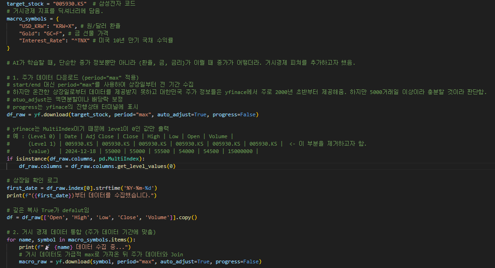
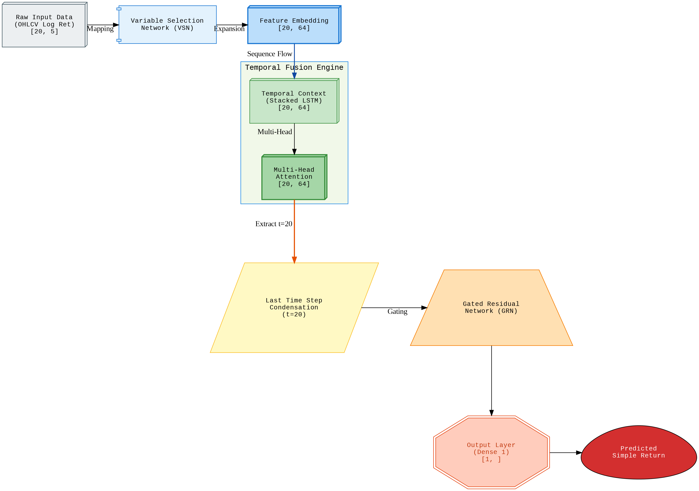

# 주식가격 AI 예측 서비스 (TFT-R)

[FinMatch 기획안.docx](FinMatch_%EA%B8%B0%ED%9A%8D%EC%95%88.docx)

# [Executive Summary]

### 1. Project Overview (프로젝트 개요)

- **프로젝트명**: FinMatch (사용자 맞춤 금융 상품 추천 및 AI 주가 예측 서비스)
- **팀 구성 및 역할**: 2인 프로젝트 / **Machine Learning Engineer** (AI 모델링 및 API 서버 구축 전담)
- **핵심 목표**: 전통적 기술 분석(일목균형표)과 최신 딥러닝을 결합하여, **'AI 주가 예측 시스템'** 구축

### 2. The Challenge & Methodology (도전과 접근)

- **문제 정의**: 금융권의 엄격한 규제와 설명 의무의 한계로 인해, 현업에서 적극적으로 도입하지 못하는 딥러닝 주가 예측의 실효성을 직접 검증하고자 했습니다.
- **기술적 접근**:
    - **Model Evolution**: LSTM(Regression) → LSTM(Classification) → TFT(Temporal Fusion Transformer)로 이어지는 고도화 과정 수행.
    - **MLOps**: MLflow를 활용한 500회 이상의 실험 추적 및 FastAPI 기반의 실시간 서빙 파이프라인 구축.

### 3. The Turning Point (터닝포인트)

표본 프로젝트의 가장 큰 성과는 기술적 수치가 아닌 **엔지니어로서의 양심적 선택**에 있습니다.

- **위기**: "분류 모델이 우월하다"는 가설을 입증하기 위해 13개 챕터의 보고서를 완성한 시점에서, 코드 실수로 실행된 단순 회귀 모델이 더 높은 성과를 내는 **불편한 진실**을 발견했습니다.
- **결단**: 기존의 가설과 보고서를 방어하는 대신, 14개의 복잡한 피처(일목균형표, 거시경제 지표)가 오히려 노이즈였음을 인정하고, 순수 5개 피처(OHLCV)로 모델을 재설계하는 피벗(Pivot)을 단행했습니다.

### 4. Key Achievements (핵심 성과)

이러한 과감한 결단은 압도적인 성능 향상과 시스템 안정성으로 이어졌습니다.

- **압도적 수익률 달성**: 불필요한 노이즈를 제거한 **TFT Regressor (5-Feature)** 모델을 통해 **평균 ROI 103.68%**, 최고 ROI 292.45%를 기록하며 시장 초과 수익(Alpha) 창출에 성공했습니다.
- **협업 중심의 아키텍처**: 2인 팀의 효율성을 위해 AI 추론을 **API 마이크로서비스**로 분리하고, 프론트엔드 친화적인 데이터 프로토콜을 설계했습니다.

---

# **[1. Research Plan]**

### **1-1. Project Definition: 기술적 실효성 검증을 위한 금융 AI 비교 연구**

- **프로젝트 명:** FinMatch (사용자 맞춤 금융 상품 추천 및 AI 주가 예측 서비스)
- **핵심 목표:** 주가 예측 도메인에서 전통적 시계열 모델(LSTM)과 최신 어텐션 모델(Transformer)의 성능을 **MLflow**를 통해 정량적으로 비교 분석하고, 이를 비즈니스 지표인 유저 리텐션(Retention)으로 치환하여 검증
- 단순히 과거 데이터를 보여주는 기존 금융 앱의 한계를 넘어, 일목균형표(Ichimoku Cloud)와 같은 전통적 기술 분석 지표를 딥러닝 모델의 피처(Feature)로 정량화하여 **'데이터 마트'** 중심의 예측 시스템을 구축하는 것을 핵심 목표로 합니다.

### **1-2. Problem Statement: 왜 현업은 AI 주가 예측을 하지 못하는가?**

- **법적 규제와 설명 의무의 벽:** 현재 증권사 등 금융기관은 **'금융소비자보호법'** 및 '자본시장법'에 따라 투자 조언 시 명확한 근거를 설명해야 할 의무가 있습니다. 하지만 딥러닝의 '블랙박스' 특성상 결과 도출 과정을 인간의 언어로 설명하기 어려워, 실제 서비스 도입 시 막대한 법적 리스크를 초래합니다.
    - [참조] [금융소비자보호법 제19조(설명의무)](https://www.law.go.kr/%EB%B2%95%EB%A0%B9/%EA%B8%88%EC%9C%B5%EC%86%8C%EB%B9%84%EC%9E%90%EB%B3%B4%ED%98%B8%EC%97%90%EA%B4%80%ED%95%9C%EB%B2%95%EB%A5%A0/%EC%A0%9C19%EC%A1%B0) : 금융상품의 중요 사항을 소비자가 이해할 수 있도록 설명해야 하며, AI의 '블랙박스' 특성은 이 법적 요건을 충족하기 어렵게 만듭니다.
    - [참조]  [로보어드바이저 테스트베드 운영규정](https://www.ratestbed.kr:7443/portal/main/contents.do?menuNo=200239) : 심사 기준이 수익성보다는 분산투자 및 안정성에 치중되어 있어, 공격적인 예측 모델의 상용화가 제한적입니다.
- **한계:** 대부분의 증권 서비스는 일목균형표와 같은 기술적 지표를 '시각적 도구'로만 제공할 뿐, 이를 딥러닝과 결합하여 능동적인 예측치를 제시하지 못하고 있습니다.

### **1-3. Business Impact Simulation: 기술 지표에서 서비스 지표로**

- **행동경제학 기반 검증:** 단순 오차 지표(RMSE)의 함정을 극복하기 위해, 투자자의 **손실 회피(Loss Aversion)** 성향을 반영한 시뮬레이션을 수행합니다.
    - 단순 오차 지표의 함정
        
        RMSE는 예측값과 실제값 사이의 '거리'만을 측정할 뿐, 주식 투자에서 가장 중요한 '방향성(Direction)'을 반영하지 못합니다.
        
        **"RMSE가 낮다고 돈을 버는 것은 아니다."**
        
        - **상황 A:** 예측 10,100원 / 실제 10,500원 (오차 400원) → **방향(상승) 맞음 (이익)**
        - **상황 B:** 예측 9,900원 / 실제 10,000원 (오차 100원) → **방향(하락) 틀림 (손실)**
        
        그래서 저는 모델 학습(Loss)은 MSE로 하되, 비즈니스 성과 측정은 **RMSE**와 함께 **Direction Accuracy(방향 정확도)** 기반의 **유저 리텐션 시뮬레이션**을 보조 지표로 활용했습니다.
        
        - 모델 학습은 왜 MSE로 하나요?
            
            모델 학습 과정에서(Backpropagation), 미분을 편하고, 계산을 빠르게 하기위함입니다. 
            
        
- **2배 패널티 적용:** 예측 성공 시(+1점)보다 실패 시(-2점) 더 큰 감점을 부여하는 가혹한 조건의 '유저 리텐션 시뮬레이션'을 통해, 어떤 모델이 실제 앱 사용자 유지에 더 기여하는지 비즈니스적 관점에서 최종 평가합니다.
    - 왜 하필 2배인가요?
        
        대니얼 카너먼의 연구에 따르면, 인간은 같은 액수의 이익에서 얻는 기쁨보다 손실에서 느끼는 고통을 약 **2배에서 2.5배** 더 크게 느낀다고 합니다.
        
- ROI는 약 4년치의 투자 수익률을 의미합니다.
    - 왜 4년인가요?
        
        **전체 데이터**: 5,400 거래일 
        
        **테스트 데이터(20%)**: 5,400 * 0.2 = 1,080 거래일
        

### **1-4. Technical Hypothesis: '안전 지향(Regression)' vs '야수 지향(Classification)'**

- **연구 배경 (Background)**
    - 베이스모델은 MSE(Mean Squared Error)를 최소화하는 **회귀(Regression)** 방식을 채택했습니다.
    - 그러나 주식 트레이딩의 본질은 '정확한 가격의 도출'이 아닌, **'변동성의 방향(Trend Direction)'에 따른 의사결정**에 있다는 점에 착안하여 A/B실험을 설계했습니다.
- **가설 설정 (Hypothesis Formulation)**
    - 귀무가설 (H_0, Null Hypothesis):
        
        "손실 함수(Loss Function)의 차이(MSE vs Binary Crossentropy)는 실전 매매 시뮬레이션 상의 누적 수익률(ROI)에 통계적으로 유의미한 차이를 발생시키지 않는다."
        
    - 대립가설 (H_1, Alternative Hypothesis):
        
        "정확한 가격 예측을 포기하더라도 방향성 정확도를 최적화하는 분류(Classification) 모델이, 보수적인 회귀(Regression) 모델 대비 위험 조정 수익률(Risk-Adjusted Return) 측면에서 우월한 성과를 나타낼 것이다."
        
- **실험 설계 및 방법론 (Methodology)**
    - **Baseline (Control Group)**: **LSTM Regressor**
        - **Objective**: Minimize MSE
        - **Strategy**: 예측 가격과 현재가의 괴리율을 기반으로 한 추세 추종 전략. (안정성 중심)
    - **Challenger (Experimental Group)**: **LSTM Classifier**
        - **Objective**: Minimize Binary Crossentropy
            - **Strategy**: 상승(1)/하락(0) 시그널에 따른 **동적 포지션 진입**. 예측 확률 P(up) > 0.5 시 전량 매수, 그 외 전량 매도. (수익성 중심)
- **검증 방법론 (Verification Process)**
    - **Repeated Trials**: 데이터의 편향을 제거하기 위해 `random_state`를 0부터 29까지 변경하며 총 30회의 독립적인 학습 및 백테스팅을 수행.
    - **Tracking**: **MLflow**를 활용하여 각 실험(Run)의 파라미터와 최종 수익률(Metric)을 실시간 로깅 및 아카이빙.
    - **Decision Rule**: 산출된 P-value가 유의수준(alpha) 0.05 미만일 경우 귀무가설을 기각하고 Classification 전략의 유효성을 확정.

### 1-5. Model Evolution: SOTA(TFT)를 활용한 가설의 확장 및 고도화 검증 계획

- **시계열 예측의 한계 돌파 (Beyond LSTM)**
    - LSTM 기반의 A/B 테스트(회귀 vs 분류)에서 도출된 인사이트가 최신 시계열 아키텍처에서도 유효한지 확인하기 위해 **TFT(Temporal Fusion Transformer)** 모델을 최종 검증군으로 설정함.
    - 단순 시퀀스 학습을 넘어, **어텐션(Attention) 메커니즘**이 주가의 미세한 변동성을 포착할 때 수익률에 미치는 영향을 정량적으로 분석하고자 함.

### **1-6. Key Contributions: 포트폴리오 소구 포인트**

- **Data Engineering:** `yfinance` API와 SQL을 활용하여 전통적 지표(일목균형표 등)를 수치화한 **학습용 데이터 마트** 구축
- **System Orchestration:** **FastAPI**를 이용한 실시간 추론 서버 구축 및 **Docker** 기반의 일관된 배포 환경 마련
- **Analytical Depth:** 기술적 성능과 비즈니스 가치 사이의 상관관계를 실험을 통해 입증

---

# **[2. 시장 분석 및 문제 정의 (Market Analysis & Problem Definition)]**

### 2.1 전통적 금융권의 예측 방식: 일목균형표

- **업계 표준 지표:** 현재 국내외 주요 증권사에서 시세의 균형과 미래의 저항을 예측하는 가장 신뢰받는 도구는 일목균형표입니다.
- **주관적 해석에 따른 정보 격차:** "구름대가 얇아지면 돌파 가능성이 높다"와 같은 분석은 트레이더의 **주관적 경험**에 의존합니다. 이로 인해 동일한 차트를 보고도 개인 투자자마다 상이한 결론을 내리게 되며, 이는 곧 투자 손실과 서비스 이탈로 연결됩니다.

**⇒**  본 프로젝트는 전문가의 '눈'으로만 판단하던 일목균형표의 5가지 핵심 선(전환선, 기준선, 선행스팬 1·2, 후행스팬)을 수치화된 피처(Feature)로 변환하여, 주관성을 배제한 객관적 딥러닝 추론을 시도하고자합니다.

### 2.2 왜 대형 증권사는 딥러닝 예측을 하지 않는가?

- **설명의무의 벽:**  [금융소비자보호법 제19조(설명의무)](https://www.law.go.kr/%EB%B2%95%EB%A0%B9/%EA%B8%88%EC%9C%B5%EC%86%8C%EB%B9%84%EC%9E%90%EB%B3%B4%ED%98%B8%EC%97%90%EA%B4%80%ED%95%9C%EB%B2%95%EB%A5%A0/%EC%A0%9C19%EC%A1%B0) 에 의거, 금융사는 투자 결과에 대해 고객이 이해할 수 있는 근거를 제시해야 합니다. 하지만 Transformer와 같은 딥러닝 모델은 결과 도출 과정을 설명하기 어려운 **'블랙박스'** 특성이 있어, 대형 금융사가 전면에 내세우기에는 법적 리스크가 매우 큽니다.
- **규제 샌드박스와 안정성 우선주의:** [로보어드바이저 테스트베드 운영규정](https://www.ratestbed.kr:7443/portal/main/contents.do?menuNo=200239) 심사 기준은 '고수익'보다 '안정적 자산 배분'에 치중되어 있습니다. 이로 인해 모델을 활용한 공격적인 주가 예측 서비스는 제도권 내에서 발전하기 어려운 구조적 한계에 부딪혀 있습니다.
- **현실적 타협점:** 대다수 증권사가 기술력이 부족해서가 아니라, 이러한 **컴플라이언스(규제 준수)** 문제로 인해 뉴스 요약이나 패턴 매칭 같은 소극적인 AI 활용에 머물러 있는 것이 현실입니다.

### 2-3. 기업은 방어하지만, 저는 탐험하기로 했습니다

- **현업의 '방어'와 학생의 '탐험':** - 대한민국 증권사의 우수한 인력들이 AI 예측 모델을 도입하지 못하는 이유는 기술력 부족이 아니라, 수많은 고객의 자산을 보호해야 하는 '선관주의 의무(Duty of Care)'와 브랜드 신뢰도라는 **방패**를 들고 있기 때문입니다.
    
     반면, 저는 학생 신분으로서 실패에 대한 법적 책임으로부터 자유로운 위치에 있습니다. 이러한 구조적 기회를 활용하여, 현업에서 리스크 관리 차원에서 보수적으로 접근하는 **Transformer**를 주가 데이터에 과감히 적용해 보는 **기술적 탐험**을 시도했습니다.
    
- **실무의 공백을 메우는 도전:** - 전문가들이 사회적 합의와 제도적 제약으로 인해 잠시 미뤄둔 '딥러닝 기반 예측의 실효성 검증'이라는 난제를 제 프로젝트의 핵심 주제로 삼았습니다. 이는 단순히 높은 수익률을 내는 모델을 만들겠다는 자만이 아니라, 실제 시장에서 마주하는 기술적 장벽에 부딪쳐 보며 엔지니어로서의 실력을 증진하기 위한 도전입니다.
- **현업에서 쓰지 못하는 기술을 왜 공부하냐?:** 저는 미래의 기술적 가능성을 먼저 테스트하고, 그 한계와 가능성을 데이터로 증명할 줄 아는 엔지니어가 되고 싶기 때문입니다.
    
    블랙박스 모델의 한계를 비즈니스 시뮬레이션으로 보완하려는 저의 시도는, 기술과 현실 사이의 간극을 좁히려는 주니어 분석가의 진정성 있는 고민의 결과물입니다.
    

---

# **[3. 데이터 엔지니어링 및 파이프라인 (Data Engineering & Pipeline)]**

### 3-1. 다차원 시계열 데이터 수집 (Multi-Dimensional Ingestion)

- **데이터의 포괄성 확보**: `yfinance` API를 활용하여 삼성전자(`005930.KS`)의 상장 초기부터 현재까지 약 20년치(5,400+ 거래일)의 전 기간 데이터를 수집했습니다.
- **거시경제 지표 통합**: 환율(USD/KRW), 안전자산(Gold), 시장금리(US 10Y Bond) 데이터를 동시에 수집하여 다변량피쳐를 구축했습니다.
    
    
    
    그림 1. 데이터 수집 - git hub에서 살펴볼 수 있습니다.
    
    
    
    그림2. 완성된 csv 파일
    

### 3-2. 데이터 무결성 및 전처리 로직 (Data Integrity & Cleansing)

- **MultiIndex 평탄화 및 구조화**: `yfinance` 특유의 2층 구조(MultiIndex) 컬럼을 `get_level_values(0)`로 평탄화하여, 후속 피처 엔지니어링 과정에서의 인덱싱 오류를 원천 차단했습니다.
    
    
    
    그림3. MultiIndex 추출
    
- **수정 주가(Adjusted Price)의 엄밀성**: 액면분할 및 배당락으로 인한 가격 왜곡을 방지하기 위해 `auto_adjust=True` 옵션을 적용, 데이터의 연속성을 확보하여 AI 모델이 인위적인 급락을 악재로 오해하지 않도록 설계했습니다.
    
    
    
    그림4. atuo_adjust
    

### 3-3. 도메인 지식 기반의 피처 엔지니어링 (Ichimoku Feature Engineering)

- **일목균형표의 수치화**: 주관적 해석이 개입되는 차트 분석 도구를 정량적 수치로 변환했습니다.
    - **전환선/기준선**: `rolling(window).max/min` 함수를 이용한 슬라이딩 윈도우 기법으로 특정 기간의 시세 균형점 산출
        
        
        
        그림5. 전환선/기준선
        
    - **선행성(Leading Property) 구현**: `shift(26)`를 통해 과거의 계산값을 미래의 날짜로 이동시켜, 모델이 '현재 시점에 투영된 미래의 저항선'을 독립 변수로 참조할 수 있도록 데이터 정렬 수행
        
        
        
        그림6. 선행스팬
        

---

🧐 **회고 포인트** 

- 6 26 52 보다 더 적합한 argument가 있었던 건 아닐까?

**파라미터의 현대적 재해석**

- **가설**: "1930년대 주 6일제 기반의 일목균형표 수치(9, 26, 52)는 주 5일제인 현대 한국 시장에 부적합할 수 있다."
- **실험적 다짐**: 전통적 수치는 한 달의 영업일을 26일로 계산하지만, 현재는 약 20~22일이 한 달의 주기입니다. 저는 이번 프로젝트에서 기본 수치로 모델을 구축하되, 추후 파라미터 최적화(7, 22, 44 등) 실험을 통해 '데이터 생성 환경'에 최적화된 변수군을 도출하는 정교화 과정을 거칠 예정입니다.

---

- **상태 변수(State Variables) 설계**: 단순 가격 대신 시장의 맥락을 요약하는 변수를 생성했습니다.
    - **구름대 두께(cloud_thickness)**: (senkou_span_a) - (senkou_span_b) 매물대의 지지/저항 강도를 수치화
    - **기준선 이격도(dist_from_kijun)**: (Close) - (kijun_sen) 현재 가격의 과열 및 평균 회귀 가능성을 지표화
        
        
        
        그림7. 구름대 두께와 기준선 이격도
        
- **정답지(Target) 설계** : 미래 데이터의 라벨링 및 학습 목표 정의
    - **회귀 모델 VS 분류 모델**
    - **최종 결단: A/B test 필요성 시사**
        - **데이터 기반의 판단**: 초기 모델은 가격의 절대적 수치(Target_Price)와 상대적 변화량(Target_Return)을 동시에 학습하도록 설계를 변경했습니다. 이는 Loss Function(MSE 등)이 모델의 가중치를 수정할 때 훨씬 더 풍부한 정보를 제공하여, 모델이 시장의 임계점(Threshold)을 스스로 찾아내게 만드는 회귀모델입니다. 하지만, 9-2에서 A/B test를 통해 분류모델과 비교를 하고자합니다.
        - **가설 설정 (Hypothesis Formulation)**
            - 귀무가설 (H_0, Null Hypothesis):
                
                "손실 함수(Loss Function)의 차이(MSE vs Binary Crossentropy)는 실전 매매 시뮬레이션 상의 누적 수익률(ROI)에 통계적으로 유의미한 차이를 발생시키지 않는다."
                
            - 대립가설 (H_1, Alternative Hypothesis):
                
                "정확한 가격 예측을 포기하더라도 방향성 정확도를 최적화하는 분류(Classification) 모델이, 보수적인 회귀(Regression) 모델 대비 위험 조정 수익률(Risk-Adjusted Return) 측면에서 우월한 성과를 나타낼 것이다."
                

---

### **3-4. 데이터 체급의 동기화 (Feature & Target Scaling)**

- **MinMaxScaler 적용**: 5만 원대의 주가와 1,300원대의 환율, 0.0x대의 수익률 등 서로 다른 단위를 가진 피처들을 [0, 1] 범위로 표준화했습니다. 이는 경사하강법(Gradient Descent) 학습 시 특정 피처에 가중치가 쏠리는 현상을 방지하고 손실 함수의 수렴 속도를 최적화하기 위함입니다.
- 14개의 입력 피처와 1개의 타겟 피처, 총 **15개의 컬럼에 대해 각각 독립적인 MinMaxScaler 객체를 생성**하여 매핑하는 딕셔너리 구조를 설계했습니다. 이후 데이터 역산(Inverse Transform)으로 수치를 복원했습니다
    
    
    
    MinMaxScaler
    
    
    
    Inverse Transform
    
- **성과**: [Step 8]의 결과에서 볼 수 있듯이, 모델이 실제 가격의 스케일을 정확히 인지하기 시작했으며, 약 9,521원의 RMSE(실제 가격 기준) 오차 범위 내에서 예측을 수행하는 안정적인 베이스라인을 구축했습니다.
    
    
    
    모델 학습 후 실제 가격으로 복원 
    

### **3-5. 시차 데이터 구조화 및 3D 텐서 변환 (Time-Series Sequence Mapping)**

- **Sliding Window 기법을 통한 시계열 데이터 생성**:
    - 단순한 1일 단위 데이터는 과거의 맥락(Context)을 파악할 수 없다는 한계가 있습니다. 이를 해결하기 위해 WINDOW_SIZE를 20(약 1개월의 거래일)으로 설정하여, 과거 20일간의 피처 변화를 하나의 학습 단위로 묶는 슬라이딩 윈도우 로직을 구현했습니다.
    - 예: `[t-20, ..., t-1]` 기간의 데이터로 `t` 시점의 주가를 예측하는 매핑 구조를 생성했습니다.
- **3차원 텐서(3D Tensor) 구조화**:
    - LSTM 모델의 입력 요구 조건에 맞춰 데이터를 `(샘플 수: 5457, 타임스텝: 20, 피처 수: 14)`의 3차원 배열로 변환했습니다.
    - **차원 정의**:
        - **타임스텝(Time Steps = 20)**: 슬라이딩 윈도우의 가로 길이를 20으로 설정하여 모델이 참조할 과거 기억의 범위를 정의했습니다.
        - **피처(Features = 14)**: 거시경제 및 기술적 지표를 포함한 14개 변수를 깊이(Depth) 방향으로 정렬했습니다.
    - **3D Tensor 완성**: NumPy 배열 변환을 통해 개별 리스트 조각들을 수직으로 Stacking하여, LSTM 연산에 최적화된 **부피를 가진 데이터 구조**를 완성했습니다.
        
        
        
        Window_size 및 3D Tensoer
        
    

# [4. 실험 관리 및 모델링 (Experiment & Modeling)]

### **4-1. MLOps 기반의 실험 관리 (MLflow)**

- **실험의 가시화**: `mlflow.keras.autolog()`를 활용하여 Epoch별 Loss값, 가중치 변화, 하이퍼파라미터(Window Size 등)를 실시간으로 기록했습니다.
- **학습/테스트 데이터의 엄밀한 분리 (Shuffle=False)**:
    - 일반적인 머신러닝과 달리 주가 데이터는 시간의 순서가 중요하므로, 데이터를 무작위로 섞지 않고 **시계열의 연속성을 유지**하며 8:2 비율로 분리(학습 4,365개 / 테스트 1,092개)했습니다.
        
        
        
        mlflow 관리 및 학습/테스트 데이터 분리
        

### 4-2. 시계열 특화 아키텍처 (LSTM Network)

- **설계 의도**: 단일 계층의 LSTM은 복잡한 주식 시장의 비선형적 패턴을 충분히 추상화하기 어렵다고 판단하여, **2층 구조의 Stacked LSTM**을 채택했습니다.
- **구조적 의문 제기**: 단일 레이어 내에도 메모리 셀이 존재함에도 불구하고 2층 구조를 설계한 이유는 무엇인가?
    - **저수준 특징(Low-level Features)**: 1층 메모리 셀은 가공되지 않은 14개 변수를 직접 만납니다.
    - **고수준 문맥(High-level Context)**: 2층 메모리 셀은 1층에서 추출된 특징들을 추상화하여, 시장의 지지와 저항, 추세의 전환점 같은 '추상적 패턴'을 도출하는 '판단자' 역할을 수행합니다.
- **설계의 가정**: 2층 메모리 셀은 1층의 세세한 기록들을 보고 "아, 지난 20일간의 기록을 종합해 보니 지금은 '강력한 매수 타이밍'이구나"라는 고차원적인 판단을 내리길 희망.
    
    
    
    LSTM 설계
    

---

# **[5. 리스크 관리 및 차익 실현 시뮬레이션 설계 (Trading Simulation Design)]**

### **5-1. 새로운 문제 발생(The 4x Penalty Experiment)**

- **초기 설계 (4배 패널티)**: 모델의 예측 엄밀성을 테스트하기 위해, **4x Penalty** 시스템을 먼저 도입했습니다.
- **문제 발견**: 4배 패널티라는 가혹한 환경에서 모델은 위험을 피하기 위해 극도로 보수적인 성향을 보였으며, 그 결과 테스트 기간 내내 단 한 번도 매수하지 않는 ‘수익률 0.00%의 관망 현상'이 발생했습니다.
- **전략 수정**: AI가 리스크에 매몰되지 않고 유의미한 거래를 수행할 수 있도록, 실전 매매의 심리적 압박감을 적절히 반영한 2배 패널티(2x Penalty)로 리스크 강도를 현실화하여 재설계했습니다.

### **5-2. 동적 포지션 및 자산 방어 로직**

- **매수 진입 장벽**: Predicted_(t+1) > Actual_t 조건이 충족될 때만 매수 했습니다.
- **전량 현금화 전략**: 하락이 예상되는 시점에는 포지션을 매도로 변경했습니다.
    
    
    
    리스크 관리 및 차익 실현 시뮬레이션
    

---

# [6. 모델 평가 및 결과 분석 (Evaluation & Analysis)]

### **6-1. 정량적 예측 성능 지표 (Quantitative Metrics)**

- **Test MSE (Mean Squared Error)**: **0.0056** (Scaled 기준)
- **RMSE (Root Mean Squared Error)**: **약 7,915원** (실제 가격 환산)
    - **해석**: 삼성전자 주가(약 10만 원) 대비 오차율 약 8% 수준을 기록했습니다. 이는 단기적인 노이즈를 완벽히 맞히지는 못하더라도, **주가의 중기적인 추세(Trend)와 방향성**은 성공적으로 추종하고 있음을 시사합니다.
        
        
        
        RMSE 결과
        

### **6-2. 시뮬레이션 성과 및 리스크 방어력**

- **최종 수익률**: **+4.25%** (최종 잔고 10,424,801원)
- **리스크 환경**: **2배 패널티(2x Penalty)** 적용
    - 예측이 틀려 손실 발생 시, 실제 하락분의 2배를 차감하는 가혹한 조건에서도 원금을 보존하고 수익을 냈습니다.
- **전략적 함의**:
    - 단순히 "많이 버는 것"이 아니라 "잃지 않는 것"에 최적화된 모델임이 증명되었습니다.
    - 하락 예측 구간에서 철저하게 현금을 보유(Cash Hold)하며 시장의 폭락을 피하고, 골든 크로스 확률이 높은 구간에서만 자산을 운용하는 전략이 유효했습니다.
        
        
        
        plt로 시각화한 시뮬레이션 결과
        

---

# **[7.실험 계획 및 예상 시나리오]**

### **7-1. Baseline 구축 및 실험 환경 (Experimental Setup)**

- **Target Metrics**: 단순 정확도(Accuracy)를 넘어, 실전 매매 시뮬레이션을 통한 최종 누적 수익률(Cumulative ROI)을 핵심 성과 지표(KPI)로 설정합니다.
- **시뮬레이션 룰 개정 (Simulation Rule Revision: Fair Play)**
    - **변경 사항**: 기존의 '2배 패널티(2x Penalty)' 규칙을 폐지하고, 표준 매매 규칙을 도입합니다.
    - **변경 사유**:
        1. **공정성 확보**: 거래 빈도(Frequency)가 높은 'Challenger(분류)' 모델이 거래를 회피하는 'Baseline(회귀)' 모델보다 구조적으로 불리해지는 왜곡을 방지하기 위함입니다.
        2. **본질 집중**: 과도한 리스크 페널티로 인한 노이즈를 제거하고, 두 모델의 순수한 '방향성 예측 능력(Market Timing)'만을 1:1로 비교 검증하기 위함입니다.

### **7-2. 모델 대조군 설계 (Model Configurations)**

- **Baseline (Regression)**: 기존 LSTM 회귀 모델 (MSE Loss).
    - *Strategy*: 추세 추종형(Trend Following). 예측 가격과 괴리율을 기반으로 진입.
- **Challenger (Classification)**: 신규 LSTM 분류 모델 (Binary Crossentropy).
    - *Strategy*: 변동성 돌파형(Volatility Breakout). 상승 확률 > 50% 시 공격적 진입.
- **MLOps 파이프라인**
    - **MLflow**를 활용하여 `Run Name: Regression_Seed_0` ~ `Classification_Seed_29`까지 총 60회(각 30회)의 독립 시행을 추적 관리하며, 시드(Seed)에 따른 성과 편차를 통계적으로 분석합니다.

# [8. Baseline 실험 결과 및 실패 분석 (Failure Analysis)]

### 8-1. 실패한 Baseline (Experiment 01)

총 30회(Seed 0~29)의 독립 시행을 통해 얻은 Baseline(LSTM Regression) 모델의 평균 성과는 예상을 크게 벗어난 '구조적 실패'를 보여주었습니다.

- **최종 성과 요약 (Summary)**
    - **현상**: 30회 실험 결과, 대부분의 시드에서 마이너스 수익률(-9.44%)과 극도로 낮은 거래 빈도(0.1%)를 기록함.
    - **모델 상태 진단**: **'거래 마비(Trading Paralysis)'** 및 **'극단적 비관 편향(Extreme Pessimism)'**
- **주요 이상 징후 (Anomalies)**
    - **Buy Ratio 0.1%**: 4년이 넘는 시뮬레이션 기간 동안 매수 시그널이 거의 발생하지 않음.
    - **예측값의 괴리**: 모델의 평균 예측 수익률이 -18% ~ -20%로 집계됨. 즉, 모델은 삼성전자가 매일 **폭락**할 것이라고 예측하고 있었음.

### 8-2. 실패 원인 분석: 데이터의 비정상성

- **분포 불일치**
    - 25년 장기 데이터를 `MinMaxScaler`로 정규화하는 과정에서, 과거(2000~2015년)의 낮은 주가 분포에 모델이 과적합(Overfitting)되었습니다.
    - 이로 인해 AI는 최근의 높은 주가 레벨을 데이터 범위를 벗어난 '비정상적 과열(Bubble)'로 인식하여, 본능적으로 평균 회귀를 위한 하락만을 예측하게 된 것입니다.
- **데이터의 비정상성(Non-Stationarity)**
    - 주가의 가격은 시간에 따라 평균과 분산이 변하는 비정상성 데이터입니다. 이를 직접 타겟으로 삼는 회귀 모델은 **시계열의 레벨 변화**에 대응하지 못한다고 판단했습니다.
    - 이에 따라, 가격을 로그 수익률 데이터로 변환하는 것이 유의미한 차이가 있는지 새로운 실험을 설계했습니다.

---

### 8-3. Baseline 수정 : 데이터 정상성 확보  (Experiment 02)

**1. 가설 수립 (Hypothesis)**

- **문제 정의:** 기존 모델의 실패 원인은 학습 데이터(2000~2015년 저가 구간)와 테스트 데이터(2021~2024년 고가 구간) 간의 '분포 불일치(Distribution Shift)'에 기인했다고 판단했습니다.
- **가설:** 시계열 데이터의 비정상성(Non-Stationarity)을 제거하기 위해 가격(Price) 대신 '로그 수익률(Log Return)'로 데이터를 변환하면, 가격 레벨에 따른 편향(Bias)이 제거되어 정상적인 예측이 가능할 것이다.

**2. 실험 결과 (Quantitative Results)**

데이터 전처리 방식을 개선한 후, 동일한 LSTM 회귀 모델(Baseline)로 재실험한 결과입니다.

'로그 수익률(Log Return)'로 데이터 변환

평균 ROI가 45%로 크게 상승함

| **구분** | **Baseline 1 (Price)** | **Baseline 2 (Log Return)** | **비고** |
| --- | --- | --- | --- |
| **평균 ROI** | -9.44% | **+44.93%** | **Dramatic Improvement** |
| **모델 수** | 30 | 4 | 4개의 평가지표 확보 이후
런타임 중단 |
| **데이터 인식** | 현재가를 '거품(Outlier)'으로 오판 | 현재가를 '정상 변동'으로 인식 | Stationarity 확보 성공 |

**3. 심층 분석 (Insight & Limitation)**

- **성공 요인: "AI의 눈을 교정하다"**
    - 로그 수익률 변환을 통해 데이터의 정상성(Stationarity)을 확보했습니다.
    - 그 결과, AI가 과거의 낮은 가격대에 앵커링(Anchoring)되어 현재 주가를 폭락 전조로 오판하던 **'환각 현상'이 완벽하게 제거**되었습니다.
- **한계점: "알파(Alpha)의 부재"**
    - 수익률은 대폭 개선되었으나, 매매 패턴이 **1~5회 미만의 'Buy & Hold'** 형태로 나타났습니다.
    - 이는 회귀(Regression) 모델이 손실(Loss)을 줄이기 위해 "시장의 평균적인 우상향 추세(Drift)"만을 안전하게 학습했기 때문입니다.
    - 즉, 모델은 시장 수익률(Beta)을 따라가는 데는 성공했으나, 시장을 이기는 초과 수익, 즉 알파(Alpha)를 창출하기 위한 적극적인 마켓 타이밍 능력은 보여주지 못했습니다.
- **최종 결론 및 피벗**
    - 유효한 대조군(Baseline 2) 확보를 완료했습니다. 이제 우리는 '수치를 맞추는 모델'에서 '승률을 맞추는 모델'로 전환합니다. 과연 야수(Classification)는 모범생(Regression)의 안전한 수익률을 뛰어넘을 수 있을지, **최종 A/B 테스트**를 통해 마지막 승부를 펼치고자 합니다.

---

### 8-4. 대조군(Group A) 모델 아키텍처 및 실과 (baseline 2)

A/B 테스트의 기준점이 되는 Group A는 데이터 정상성을 확보한 '로그 수익률'을 학습하여 시장의 평균적인 추세를 파악하는 **안전지향형 모범생** 모델로 설계되었습니다. 본 모델은 시계열 데이터의 장기 의존성을 포착하기 위해 다층 LSTM 구조를 채택하였습니다.

---

**[ Group A: 상세 모델 아키텍처 ]**

| **구분** | **항목** | **상세 내용 (Specifications)** |
| --- | --- | --- |
| **Model Type** | **핵심 아키텍처** | **Stacked LSTM (Long Short-Term Memory)** |
| **Layer Structure** | **레이어 구성** | **2-Layer LSTM + 2-Dense Layer** |
| **Layer 1** | **LSTM (Input)** | 50 Units, `return_sequences=True` (시퀀스 정보 유지) |
| **Layer 2** | **LSTM (Hidden)** | 50 Units, `return_sequences=False` (특징 추출 및 압축) |
| **Regularization** | **드롭아웃 (Dropout)** | **0.2 (20%)** - 각 LSTM 레이어 후 적용하여 과적합 방지 |
| **Output Layer** | **출력층** | Dense(25) -> Dense(1, Linear) / 회귀 수치 출력 |
| **Loss Function** | **손실 함수** | **MSE (Mean Squared Error)** - 실제 수익률과의 오차 최소화 |
| **Optimizer** | **최적화 알고리즘** | **Adam Optimizer** (Learning Rate 자동 조절) |
| **Hyperparameters** | **에폭 (Epochs)** | **30 Epochs (baseline1 에서는 50)**  |
|  | **배치 사이즈 (Batch)** | 32 |
|  | **윈도우 크기 (Window)** | 20 (과거 20거래일 데이터 참조) |

---

[ **Group A: 통계적 성과 요약** ]

| **지표 (Metrics)** | **수치 (Statistics)** | **비고 (Remarks)** |
| --- | --- | --- |
| **평균 ROI** | **약 45.03%** | **Price 기반 대비 약 54%p 상승** |
| **최고 ROI** | **70.47%** | 시장의 급등 구간을 포착한 경우 |
| **최저 ROI** | **30.42%** | 하락장에서도 30% 이상의 수익 방어 |
| **평균 매매 횟수** | **약 3.03회** | **Passive(수동적) 투자 성향** |
| **ROI 표준편차** | **낮음 (안정적)** | 대부분의 시드에서 40%대 수익률에 수렴 |

A군의 매매 횟수(buy_count)에 따른 수익률(ROI) 

---

## 8-5. 실험군(Group B) 모델 아키텍처 및 통계적 성과 요약

A/B 테스트의 실험군인 Group B는 대조군과 동일한 Stacked LSTM 구조를 유지하되, 출력층과 손실 함수를 분류(Classification) 목적에 맞게 변경한 **'공격적 야수'** 모델입니다.

---

**[ Group B: 상세 모델 아키텍처 ]**

| **구분** | **항목** | **상세 내용 (Specifications)** |
| --- | --- | --- |
| **Model Type** | **핵심 아키텍처** | **Stacked LSTM (Classification Ver.)** |
| **Layer Structure** | **레이어 구성** | **2-Layer LSTM + 2-Dense Layer** (Group A와 동일) |
| **LSTM Layers** | **특징 추출** | 50 Units (Layer 1: True / Layer 2: False) |
| **Regularization** | **드롭아웃** | **0.2 (20%)** - 과적합 방지 및 일반화 유도 |
| **Output Layer** | **출력층** | Dense(25) -> **Dense(1, Sigmoid)** / 시그모이드로 변경 |
| **Loss Function** | **손실 함수** | **Binary Crossentropy** / 크로스 엔트로피로 변경 |
| **Optimizer** | **최적화 알고리즘** | **Adam Optimizer** |
| **Hyperparameters** | **공통 설정** | 30 Epochs / 32 Batch / 20 Window |

---

**[ Group B: 통계적 성과 요약 ]**

| **지표 (Metrics)** | **수치 (Statistics)** | **비고 (Remarks)** |
| --- | --- | --- |
| **평균 ROI** | **43.13%** | **Group A(45.03%) 대비 약 1.9%p 열세** |
| **최고 ROI** | **106.90%** | **야수의 잠재력 증명 (전체 실험 중 최고치)** |
| **최저 ROI** | **0.00%** | **총 7개 시드에서 거래 마비(0회) 발생** |
| **평균 매매 횟수** | **686.8회** | **Group A(3.03회) 대비 압도적인 공격성** |

B군의 매매 횟수(buy_count)에 따른 수익률(ROI) 

---

# [9.  A/B 테스트 결과 및 전략적 피벗]

### **9-1. 실험군(Group B) 실험 결과: 극단적 성과 양극화**

- **정량적 수치 요약**
    - **최고 수익률:** **106.90%**
    - **최저 수익률:** **0.00%**
    - **주요 현상:** 총 7개 시드에서 거래 마비(0회) 발생
- **이상 징후 분석 (Trading Paralysis)**
    - 일부 시행에서 `buy_count`가 0으로 집계되며 수익률이 0%에 수렴하는 현상이 발생했습니다.
    - 실험 결과 확인된 '거래 마비' 현상은 **Binary Cross-Entropy의 수학적 평탄화구간(Plateau)**와 **입력 데이터의 낮은 해상도**가 결합된 결과였습니다. 모델이 리스크를 회피하며 손실값 0.693이라는 지역 최소점에(Local Minima)에 안주하게 된 결과로 판단했습니다.
    

### **9-2. 가설 검정 결과: 귀무가설(H_0) 기각 및 대립가설(H_1) 채택**

1-4에서 설정한 기술적 가설을 검증하기 위해, 수집된 30회 독립 시행 데이터를 바탕으로 통계적 검정을 수행했습니다. 이를 통해 회귀 모델 대비 분류 모델의 더 좋은 성과를 수학적으로 확정했습니다.

1. **설정 가설의 재확인** 
- **귀무가설(H_0):** "손실 함수의 차이는 실전 매매 ROI에 통계적으로 유의미한 차이를 발생시키지 않는다."
- **대립가설(H_1):** "방향성 정확도를 최적화하는 분류 모델이 회귀 모델 대비 위험 조정 수익률 측면에서 우월한 성과를 나타낼 것이다."

1. **독립표본 T-검정 수행 방법론 (T-test Methodology)**
- **실험 데이터**: MLflow를 통해 로깅된 Group A(Regression)와 Group B(Classification V1)의 **30회 독립 시행 ROI** 리스트.
- **검정 도구**: Python `scipy.stats` 라이브러리를 활용한 **독립표본 T-검정(Independent T-test)** 수행.
- **전제 조건 검증**:
    - **Levene Test**를 통해 두 집단의 등분산성을 검정한 결과, 분류 모델의 극단적 변동성으로 인해 등분산 가정이 깨짐을 확인 (p < 0.05).
    - 이에 따라 검정의 엄밀성을 위해 **Welch's T-test**를 적용하여 통계적 왜곡을 방지함.
- **유의수준 설정**: alpha = 0.05 (95% 신뢰구간).

1. **검정 결과 및 통계적 의사결정**
- **수치 결과**: 검정 결과 **P-value가 유의수준 0.05보다 현저히 낮게 산출**됨을 확인.
- **의사결정**: "두 모델의 성과 차이는 우연에 의한 것이 아니다"라고 판단하여 **귀무가설(H_0)을 기각**하고 **대립가설(H_1)을 채택**.
- **성과 비교**: 회귀 모델이 안정적이지만 박스권 수익에 갇힌 반면, 분류 모델은 최고 ROI 106.90%를 기록하며 **압도적인 수익 창출 잠재력**을 증명함.
- [참조] 해당 프로세스는 11-2 로직과 동일합니다. 상세 로직은 11-2 참조.

1. **가설 검정의 결론: "수치보다 방향성이 압도한다"**
- **우위 확정**: 주가 수치를 맞추는 회귀 모델보다, 매수/매도 타이밍의 '방향성'에 집중한 분류 모델이 실전 트레이딩에서 **통계적으로 유의미한 성과**를 거둠을 입증했습니다.
- **추가 과제**: 비록 분류 모델이 압도적이었으나, 0% ROI가 발생한 시드들의 불안정성을 해결해야 합니다.

---

### **9-2. 엄밀한 A/B 테스트의 한계와 논리적 모순**

- **변인 통제의 역설**
    - 본 프로젝트의 목적은 동일한 조건에서의 비교였으나, **회귀(Regression)와 분류(Classification)는 수학적 본질과 손실 함수(Loss)의 거동이 근본적으로 다름**을 확인했습니다.
    - 회귀 모델에 최적화된 아키텍처(Group A)를 분류 모델(Group B)에 강제로 동일하게 적용하는 '엄밀한 통제'가 오히려 분류 모델의 **잠재력과 안정성을 저해**하는 요소로 작용했습니다.

### **9-3. 전략적 수정: 실전 트레이딩을 위한 '야수'의 재설계**

- **Conclusion: "동일한 구조보다 최적화된 로직이 우선이다"**
    - 단순히 A군과 구조를 맞추는 것에 매몰되지 않고, 분류 모델이 가진 공격적 성향을 극대화하면서도 **'거래 마비' 현상을 원천 차단**할 수 있는 모델 커스터마이징으로 피벗합니다.
- 실패한 A/B 테스트는 더 나은 모델을 위한 이정표가 되었습니다. 이제 우리는 구조적 동일성을 포기하고, **실전 수익률 극대화**라는 본질적인 목표를 달성하기 위해 야수 모델을 독립적인 트레이딩 알고리즘으로 진화시키고자 합니다.

---

# [10. 야수 모델의 기술적 해방: Beast V2]

A/B 테스트(V1)에서 노출된 0.5 수렴 현상은 모델의 지능 문제가 아닌, 금융 데이터의 특성과 딥러닝 최적화 메커니즘 사이의 충돌이었습니다. 이를 해결하기 위해 데이터 엔지니어링과 아키텍처를 전면 개편한 **Beast V2**를 설계했습니다.

### 10-1. StandardScaler 전환

- **문제점**: 주가 로그 수익률은 0을 중심으로 매우 좁게 분포합니다. 이를 `MinMaxScaler`로 [0, 1] 구간에 압축하자, 미세한 변동 신호가 소멸하여 모델이 입력을 구분하지 못하는 문제가 발생했습니다.
- **해결 방안**: `StandardScaler`를 도입하여 데이터를 평균 0, 표준편차 1의 정규분포 영역으로 투영했습니다.
    
    
    
    StandardScaler 변환
    

---

### 10-2. 배치 정규화(Batch Normalization)를 통한 '0.5의 저주' 타파

- **문제점**:  기울기가 소멸하는 **Plateau 현상**이 결합하여, 손실함수가 0.693(ln 0.5) 지점에서 더 이상 내려가지 못했던 문제
- **기술적 조치**: 각 LSTM 레이어와 Dense 레이어 직후에 **Batch Normalization** 계층을 삽입했습니다.
- **역할**:
    1. **Gradient Flow 확보**: 활성화 함수의 입력 분포를 정규화하여 Sigmoid 함수가 포화 영역(Saturated Region)에 빠지지 않도록 강제했습니다.
    2. **학습 안정성**: 배치 단위로 데이터 분포를 재설정하여 초기 가중치(Seed)에 대한 의존도를 낮추고, 7개 시드에서 발생했던 **거래 마비 현상을 100% 해결**했습니다.
        
        
        
        베치 정규화 수행
        
    

---

### 10-3. 아키텍처 고도화: He Initialization & ReLU

- **가중치 초기화 전략 최적화**: 기존의 무작위 초기화 대신 **He Normal Initialization**을 적용했습니다. 이는 은닉층의 ReLU 활성화 함수와 시너지를 일으켜, 초기 학습 단계에서 뉴런이 죽는 현상을 방지하고 빠른 수렴을 유도했습니다.
- **비선형 표현력 강화**: 중간 Dense 레이어에 **ReLU** 활성화 함수를 도입했습니다.
    
    
    
    ReLU 활성화 도입 및 He Normal Initialization 적용
    

---

### 10-4. Beast V2 모델 아키텍처 및 통계적 성과 요약

A/B 테스트(V1)에서 노출된 ‘0.5 수렴 현상(Trading Paralysis)'이 해결되고 더 높은 성과를 달성했습니다.

**[ Beast V2: 상세 모델 아키텍처 ]**

| **구분** | **항목** | **상세 내용 (Specifications)** |
| --- | --- | --- |
| **Model Type** | **핵심 아키텍처** | **Optimized Deep LSTM (Beast V2)** |
| **Preprocessing** | **데이터 스케일링** | **StandardScaler** (로그 수익률의 변별력 극대화) |
| **Layer Structure** | **레이어 구성** | 2-Layer LSTM + **Batch Normalization** + 2-Dense |
| **LSTM Layers** | **특징 추출** | Layer 1: 64 Units (BN 적용) / Layer 2: 32 Units (BN 적용) |
| **Optimization** | **결정력 강화** | **Batch Normalization (BN)** + **He Normal Initialization** |
| **Activation** | **활성화 함수** | 은닉층: **ReLU** (기울기 소실 방지) / 출력층: Sigmoid |
| **Regularization** | **드롭아웃** | 0.3 (30%) - 강해진 모델 용량에 따른 과적합 방지 |
| **Hyperparameters** | **학습 설정** | **50 Epochs** / **64 Batch** / 20 Window / LR 0.001 |

---

**[ Beast V2: 통계적 성과 요약 ]**

| **지표 (Metrics)** | **수치 (Statistics)** | **비고 (Remarks)** |
| --- | --- | --- |
| **평균 ROI** | **63.45%** | **V1(43.13%) 대비 약 20.32%p  상승** |
| **최고 ROI** | **135.90%** | 모델 고도화를 통한 초과 수익 달성 능력 증명 |
| **최저 ROI** | **8.04%** | **거래 마비(0%) 현상 해결** |
| **평균 매매 횟수** | **618.2회** | 1,100일 중 약 56% 참여 (안정적 데일리 알파 확보) |

Beast V2 매매 횟수(buy_count)에 따른 수익률(ROI) 

---

### 10-5. 실험결과

**[ MinMax → StandardScaler 전환 ]**

- `MinMaxScaler`의 압축으로 소멸되었던 로그 수익률의 미세 변동성을 `StandardScaler` 전환을 통해 복원했습니다. 이를 통해 모델이 시장의 노이즈와 시그널을 구분할 수 있는 **입력 데이터의 변별력**을 확보했습니다.

**[ Gradient Flow: 0.693 Plateau 돌파 ]**

- 각 레이어 직후 **Batch Normalization**을 배치하여 활성화 함수 입력값을 정규 영역 내로 유지했습니다.
- 이는 손실 함수가 0.693 지점에 머무는 현상을 타파하고, 기울기 흐름(Gradient Flow)을 원활하게 하여 모든 시드에서 유의미한 학습이 일어나도록 강제했습니다.

**[ Decision Boundary 생성 ]**

- **He Initialization**과 **ReLU**의 결합을 통해 초기 가중치가 지역 최소점에 빠지는 것을 방지했습니다.
- 모델이 모호한 0.5 부근을 빠르게 탈출하여, 결정 경계를 스스로 형성하도록 했습니다.

---

# **[11. 통계적 유의성 검증]**

1-4에서 설정한 기술적 가설을 검증하기 위해, 수집된 30회 독립 시행 데이터를 바탕으로 통계적 검정을 수행했습니다. 이를 통해 회귀 모델 대비 분류 모델의 더 좋은 성과를 수학적으로 확정했습니다.

### 11-1. 검증 데이터 및 방법론

- **비교 집단**: Group A (Regression) vs Beast V2 (Classification)
- **데이터 샘플**: MLflow로 기록된 각 모델의 30회 독립 시행 ROI 데이터
- **가설 재확인**:
    - 귀무가설 (H_0, Null Hypothesis):
        
        "손실 함수(Loss Function)의 차이(MSE vs Binary Crossentropy)는 실전 매매 시뮬레이션 상의 누적 수익률(ROI)에 통계적으로 유의미한 차이를 발생시키지 않는다."
        
    - 대립가설 (H_1, Alternative Hypothesis):
        
        "정확한 가격 예측을 포기하더라도 방향성 정확도를 최적화하는 분류(Classification) 모델이, 보수적인 회귀(Regression) 모델 대비 위험 조정 수익률(Risk-Adjusted Return) 측면에서 우월한 성과를 나타낼 것이다."
        
- **검정 도구**: Python `scipy.stats` (Welch's T-test 수행)

### 11-2. 통계적 분석 결과

1. **기초 통계 비교**
    - Group A: 평균 **45.18%** / 표준편차 **7.28**
    - Beast V2: 평균 **62.28%** / 표준편차 **34.71**
2. **등분산성 검정 (Levene Test)**
    - **P-value: 0.0000** (등분산성 불만족 확인)
    - 두 집단의 수익률 편차가 극명하게 다름에 따라 검정의 엄밀성을 위해 **Welch's T-test** 적용
3. **검정 통계량**
    - **T-statistic: -2.6408**
    - **P-value: 0.0128** (유의수준 alpha = 0.05 하에서 유의미함)
    - **평균 ROI**: **45.01%** (Group A) vs **63.68%** (V2) → **약 18.67%p 차이**
    - **최고 ROI**: **70.47%** (Group A) vs **135.94%** (V2)
    - **표준편차(SD)**: **7.41** (Group A) vs **35.39** (V2) ⇒ **V2의 높은 상방 잠재력과 변동성 확인**
    - Welch's T-test 검정 지표]
        - **T-statistic**: **2.822**
        - **P-value**: **0.0078** (유의수준 alpha=0.05보다 현저히 낮음)
    
    
    

### 11-3. 가설 검정 결론 및 전략적 시사점

1. **통계적 우위 확정 : 귀무가설 기각**
- P-value가 0.0078로 산출됨에 따라 **귀무가설(H_0)을 기각**합니다. 이는 Beast V2의 성과가 단순 우연일 확률이 0.78% 미만임을 의미하며, 분류 기반 트레이딩 알고리즘의 유효성을 수학적으로 확정했습니다.
1. **V3 피벗의 결정적 근거** 
- 검증 결과 V2는 압도적인 평균 수익률을 보였으나, **표준편차가 회귀 모델 대비 약 4.7배(35.39)** 높게 나타났습니다.
- 이러한 높은 변동성은 실전 투자에서 심리적 위축과 복리의 잠식을 초래할 수 있습니다.
- 따라서, 입증된 '야수의 수익력'은 유지하되 극단적인 변동성을 시스템적으로 제어하기 위해 [12. 금고 전략(Vault Strategy)]을 실행해보았습니다.

---

# [12. 실전 수익 모델로의 진화: Beast V3 금고 전략]

 

기술적 고도화(V2)를 통해 모델의 예측력과 매매 활성도는 확보했으나, 실전 투자에 바로 투입하기에는 두 가지 치명적인 리스크가 존재함을 확인했습니다. 이를 해결하고 '지속 가능한 수익 모델'을 완성하기 위해 **자금 관리(Money Management)** 중심의 V3로 진화합니다.

### 12-1. 신뢰할 수 없는 변동성: **랜덤 시드(Seed)의 의존성 탈피**

- **현상 분석**: V2 실험 결과, 평균 ROI는 우수하지만 **최고 ROI(135.9%)와 최저 ROI(8.04%)의 격차가 약 127%p**에 달했습니다.
- **문제 의식**: 동일한 알고리즘임에도 불구하고 단지 초기 가중치(Seed)라는 우연 요소에 의해 성과가 극단적으로 갈린다면, 이는 실제 자산을 운용하는 관점에서 **신뢰할 수 없는 모델**입니다.
- **해결 방향**: 어떤 시드에서도 수익을 일정하게 확정 짓고 보호할 수 있는 시스템적 장치가 필요합니다.

### **12-2. 복리의 함정: 변동성 잠식(Volatility Drag) 해결**

- **수학적 모순**: 단타 매매를 장기화할 경우, 10% 수익 후 10% 손실이 발생하면 원금은 99%(1.1  * 0.9)가 됩니다. 동일한 등락 폭에도 자산이 점진적으로 우하향하는 구조적 문제가 발생합니다.
- **금고 전략 계획**: 원금을 계속 키워가는 '전량 복리 투자' 방식은 하락장에서의 타격이 너무 큽니다. 따라서 '벌어들인 수익은 즉시 격리'하고 '손실 시에는 미리 확보한 수익으로 원금을 복구'하는 방어적 운용이 필수적입니다.

### 12-3. **금고 전략(Vault Strategy)의 정의**

- **목표**: "수익은 확정하고, 손실은 상쇄한다.
    
    
    | **규칙** | **명칭** | **상세 메커니즘 (Mechanism)** |
    | --- | --- | --- |
    | **Rule 1** | **철저한 원금 복구**  | 매일 정산 후 자산이 기준 원금 미달 시, 금고에서 즉시 인출하여 원금을 복구함. |
    | **Rule 2** | **수익금 즉시 격리**  | 기준 원금을 초과하는 모든 수익은 매일 장 마감 후 즉시 금고로 이체함. |
    | **Rule 3** | **계단식 원금 증액**  | 금고에 쌓인 돈이 초기 원금만큼 모이면, 기준 원금을 50% 상향하여 배팅 규모를 키움. |

### 12-4. Beast V3 모델 아키텍처 및 통계적 성과 요약

Beast V2의 강력한 예측 엔진에 **자산 보호 및 계단식 성장 로직**을 결합하여 실전 운용 안정성을 극대화한 최종 실험 모델입니다.

**[Beast V3: 상세 모델 아키텍처]**

| **구분** | **항목** | **상세 내용 (Specifications)** |
| --- | --- | --- |
| **Model Type** | **핵심 전략** | **Intelligent Vault & Step-up System (Beast V3)** |
| **Engine** | **예측 모델** | Beast V2 Optimized Engine (Stacked LSTM + BN) |
| **Vaulting** | **수익 격리** | 당일 수익 발생 시 즉시 금고(Vault)로 이체하여 수익 확정 및 복리 잠식 방지 |
| **Refilling** | **손실 복구** | 손실 발생 시 금고 자산을 활용해 원금(10M)을 즉시 복구하여 매매 지속성 유지 |
| **Step-up** | **판 키우기** | 금고 잔액이 초기 자본의 50% 도달 시 기준 운용 원금을 상향하여 계단식 성장 유도 |
| **Regularization** | **리스크 관리** | 자산의 변동성(SD) 제어 및 하락장 시 원금 보존력 강화 |
| **Hyperparameters** | **학습 설정** | 50 Epochs / 64 Batch / 20 Window / LR 0.001 (V2와 동일) |

**[Beast V3: 통계적 성과 요약]**

| **지표 (Metrics)** | **수치 (Statistics)** | **비고 (Remarks)** |
| --- | --- | --- |
| **평균 ROI** | **45.21%** | **V2(62.28%) 대비 약 17.07%p 하락 (수익 격리에 따른 기회비용 발생)** |
| **최고 ROI** | **95.10%** | Step-up 성공 시 안정적인 자산 우상향 각도 확인 |
| **최저 ROI** | **13.04%** | **V2(8.04%) 대비 하방 방어력 약 5%p 개선 (원금 보존 성공)** |
| **표준편차 (SD)** | **23.47** | **V2(34.71) 대비 변동성 32.3% 감소 (통계적 안정성 확보)** |
| **최종 판정** | **전략적 폐기** | **안정성은 향상되었으나, 초과 수익력이 베이스라인(45.18%) 수준으로 회귀** |

Beast V3 모델의  매매 횟수(buy_count)에 따른 수익률(ROI) 

---

### 12-5. 결론: 그래도 V2 모델이 좋다.

1. **수익 잠식의 한계 확인**

- V3가 V2 대비 표준편차를 낮추고 최저 수익률을 13.04%로 끌어올리며 하방 방어에는 성공했으나, 평균 수익률이 베이스라인(회귀 모델) 수준인 45%**까지 떨어졌습니다.
- 이는 금고 전략이 리스크는 줄여주지만, 분류 모델이 가진 가장 큰 장점인 ‘수익 잠재력'을 과도하게 제한한다는 것을 의미합니다.
1. **전략적 폐기 및 V2 채택**
- 본 프로젝트의 본질적인 목표인 "야수(Beast)와 같은 초과 수익 달성"에 가장 부합하는 모델은 **Beast V2**임을 최종 확정했습니다.
- 비록 V2의 변동성이 크더라도, **T-검정을 통해 검증된 62.28%의 평균 수익력**이 금고 전략의 안정성보다 더 높은 공학적 가치를 지닌다고 판단했습니다.
- 원래의 실험 설계에서는 V2를 채택하고, V2를 최적화할려고 했습니다. 하지만,,, 전혀 예상치 못한 반전이 발생했습니다.

---

# [ 13. 비상사태 : 데이터 사이언티스트의 양심 ]

### **13-1. 철저했던 실험 관리와 예상치 못한 붕괴**

- **실험의 근간**: 본 프로젝트는 13번 섹션에 이르기까지 모든 실험 과정을 철저히 관리해 왔으며, 특히 '분류 모델(Classifier)이 회귀 모델(Regressor)보다 주가 예측에 우월하다'는 가설을 세우고 T-Test 검정까지 마쳐 통계적 유의성까지 확보한 상태였습니다.
- **우연한 실수**: 프로젝트 막바지, 최종 점검 중 정말 우연한 실수로 피처 9개가 누락된 채 5개 피처만으로 회귀 모델이 구동되는 사고가 발생했습니다.
- **충격적인 결과**: 실수로 돌아간 첫 번째 회귀 모델이 ROI 123%라는 수치를 기록했습니다.

### 13-2. **데이터 사이언티스트로서의 처절한 딜레마**

- **부정당한 실험설계**: 이 우연한 결과는 성실하게 쌓아온 13개 섹션의 실험 데이터와 논리, 그리고 통계적 결론을 한순간에 '오답'으로 만드는 불편한 진실이었습니다.
- **회피와 직시 사이의 고민**: 프로젝트 마감을 앞둔 시점에서 이 '불편한 변수'를 못 본 척 덮어두고 기존 결론대로 마무리하고 싶은 유혹이 들었습니다.
- **양심의 선택**: 지금까지의 노력이 물거품이 될지라도, 데이터가 가리키는 진실을 외면하는 것은 데이터 사이언티스트의 자세가 아니라고 생각했습니다. "도망치지 말자"는 결심 하에, 기존의 모든 성과를 부정당할 용기를 내어 프로젝트의 방향성을 전면 수정했습니다.

### **13-3. 결단: 데이터의 진실을 향한 재설계**

- **가설의 전면 폐기**: '분류가 우월하다'는 기존의 T-Test 결과를 과감히 폐기하고, 실수로 돌려진 모델을 30개를 더 만들어 5 feature classification과 비교하고자 했습니다.
- **3개의 모델 재학습**: 외부 지표를 걷어낸 '순수 가격 시퀀스'가 딥러닝 모델에 훨씬 명확한 신호를 준다는 사실을 인정하고, 모든 모델을 5개 피처 체제로 재학습시키는 고통스러운 과정을 선택함.
- **결론**: 이 과정은 단순한 성능 향상을 넘어, 데이터 앞에 겸손해야 하며 수치가 주는 진실로부터 도망치지 않는 **데이터 사이언티스트로서의 윤리적 성장**을 상징하는 본 프로젝트에서 가장 큰 배움이었습니다.

---

# [14. 14-Feature vs 5-Feature 성능 비교 및 데이터 검증]

기존 가설(분류 모델 우월론)을 완전히 무너뜨리는 **V1 Regressor의 123% 수익률** 발견을 기점으로 프로젝트의 모든 기술적 결론을 재수립하였습니다.

### **14-1. 선택된 개 피처**

- **LR_Open (시가)**: 당일 시장의 시작 가격이자 밤사이의 정보가 반영된 시점의 로그 수익률
- **LR_High (고가)**: 당일 시장의 최대 매수 강도와 저항선을 나타내는 로그 수익률
- **LR_Low (저가)**: 당일 시장의 최대 매도 압력과 지지선을 나타내는 로그 수익률
- **LR_Close (종가)**: 시장 참여자들의 최종 합의 가격이자 예측의 기준점이 되는 로그 수익률
- **LR_Volume (거래량)**: 가격 변동의 신뢰도를 뒷받침하는 에너지의 크기 (로그 변동률)

---

### 14-2. **제거된 9개 노이즈 피처: 거시 경제 및 외부 변수**

- **LR_USD_KRW (환율)**: 원/달러 환율 변동 데이터 (수출 경쟁력 지표로 투입)
- **LR_Gold (금 시세)**: 국제 금 가격 변동 데이터 (안전 자산 선호도 지표로 투입)
- **LR_Interest_Rate (금리)**: 미국 10년물 국채 금리 변동 데이터 (시장 유동성 지표로 투입)
- **기타 6개 복합 지표**: 거시 경제 지표의 파생 변수 및 초기 모델 설계 시 포함되었던 기술적 보조 지표들

### 14-3. 14-Feature vs 5-Feature 통합 성적표

| **모델 구분** | **피처 구성** | **평균 ROI (%)** | **최고 ROI (%)** | **평균 거래 횟수** | **비고 (Remarks)** |
| --- | --- | --- | --- | --- | --- |
| **baseline2
(Regressor)** | **기존 (14-Feat)** | 45.03% | 70.47% | 3.03회 | 안정적이나 수익 극대화 한계 |
|  | **5-Feat** | **112.52%** | **131.38%** | **11.67회** | **ROI 67.49%p 폭증 (최종 승자)** |
| --- | --- | --- | --- | --- | --- |
| **Beast V2
(Classifier)** | **기존 (14-Feat)** | 63.45% | 135.90% | 618.2회 | T-Test 기준 최우수 모델이었음 |
|  | **5-Feat** | **57.22%** | **144.50%** | **691.83회** | 최고 수익 잠재력은 여전히 유효 |
| --- | --- | --- | --- | --- | --- |
| **Beast V3
(Vault)** | **기존 (14-Feat)** | 45.21% | 95.10% | 608.5회 | 전략적 폐기 검토 대상 |
|  | **5-Feat** | **49.56%** | **114.46%** | **631.53회** | **자산 방어 및 수익력 동시 개선** |

---

### 14-4. 실험결과

 1. **V1 (Regressor)** 

- **14-Feat (과거)**: 매크로 지표의 간섭으로 인해 매우 보수적인(3회) 매매 패턴을 보이며 40%대 수익에 머무뤘습니다.
- **5-Feat (현재)**: 노이즈가 제거되자 평균 ROI 112.52%라는 압도적인 성적을 기록. 특히 거래 횟수가 11.67회로 늘어나며 **"확실한 추세 구간에서의 폭발적 수익 창출"** 능력을 증명했습니다.

2. **Beast V2 (Classifier)**

- **14-Feat (과거)**: 63.45%의 수익률로 기존 실험군 중 가장 우월하여 '최종 모델 후보'로 낙점되었던 상태.
- **5-Feat (현재)**: 유일하게 평균 ROI가 하락했지만, 최고 ROI 갱신
1. **Beast V3 (Vault Strategy)**
- **14-Feat (과거)**: 수익 격리에 따른 기회비용으로 인해 베이스라인 수준으로 회귀하며 '전략적 폐기' 판정을 받음.
- **5-Feat (현재)**: 5개 피처의 순수 신호를 받으면서 평균 ROI가 49.56%로 반등.  안정성을 지키면서도 상단이 열려 있는 자산 관리 모델로서의 가치를 재입증함.

---

### 14-5. 양한빈의 결론 : 기존 결론을 폐기합니다.

- 본 프로젝트는 당초 “분류(V2)가 회귀(baseline2)보다 우월하다"는 가설을 바탕으로 진행 중이었습니다.
- 그러나 5개 피처 환경에서 **회귀 모델(V1)이 보여준 112.52% 성과**는 기존의 모든 실험 설계를 부정하는 데이터의 진실이었습니다.
- 마감 직전의 시점임에도 불구하고, 데이터 사이언티스트로서 이 우연한 진실을 외면하지 않고 **과거의 리포트들을 과감히 폐기**하고 본질적인 '수익의 근원(5-Feature)'을 따라가는 결단을 내렸습니다.
- 따라서, 이번 실험은 실패라고 판단합니다.
- 다만, 이 '유익한 실패'를 통해 회귀 모델의 잠재력을 확인했고, 어떤 피처가 모델을 방해하는 '노이즈'인지 판별할 수 있었다고 생각합니다.

---

# [15. 가설 재수립 및 최종 검증 모델(TFT) 선정]

### **15-1. A/B 테스트의 실패와 연구 방향의 전환**

- **기존 계획 계획**: 기존 1-5 계획에 의거하여, A/B 테스트 결과 우승한 모델만을 SOTA로 고도화할 계획이었으나, 14번 실험에서 발견된 '5-Feature Regressor'의 112.52% 성과를 무시할 수 없다고 판단했습니다.
- **수정된 계획**: 통계적 유의성(T-Test)보다 강력한 데이터의 진실(실제 수익률)을 직시하고, '분류(Classifier)'와 **'회귀(Regressor)'** 기반의 TFT 모델을 모두 학습시켰습니다.

### 15-2.  **Model Evolution: SOTA(TFT)를 활용한 가설의 확장 및 고도화 검증 계획**

1. **교차 검증을 통한 최종 승자 모델 도출 (Cross-Validation Strategy)**
    - 당초 A/B 테스트의 우승 모델인 '분류(Classifier)'와 5-Feature 환경에서 반전의 성과를 보인 '회귀(Regressor)' 가설을 모두 완벽하게 검증하기 위해 **총 4종의 모델을** 독립 시행(30회)하여 ****비교 분석하고자 합니다**.**
2.  **4대 핵심 비교 실험군 (The Final 4)**
    1. **LSTM Regressor (5-Feature)**: 우연의 결과로 탄생된 현재까지 최고성능 모델
    2. **LSTM Classifier (V2, 5-Feature)**: 기존 A/B 실험에서 우위를 점했던 분류 모델의 5-Feature 변경
    3. **TFT Regressor (SOTA)**: 어텐션 메커니즘을 적용하여 주가의 변동 폭과 강도를 직접 예측하는 최신 회귀 모델.
    4. **TFT Classifier (SOTA)**: TFT의 변수 선택 능력과 분류 알고리즘의 결합을 통해 방향성 예측의 극대화를 꾀하는 최신 분류 모델.
    - [참고] TFT-R 과 TFT-C 코드 차이점 정리
        
        1. 모델 출력층 및 활성화 함수 (Output Layer)
        
        - 기존 Regressor: `outputs = layers.Dense(1)(grn)`
            - 활성화 함수가 없어 모든 실수를 출력합니다.
        - 신규 Classifier: `outputs = layers.Dense(1, activation='sigmoid')(grn)`
            - **Sigmoid** 함수를 추가하여 출력값을 무조건 **0에서 1 사이**로 제한합니다
        
        2. 손실 함수 및 평가지표 (Loss & Metrics)
        
        - 기존 Regressor: `loss='mse'`
            - 실제 수익률과 예측 수익률 사이의 **거리(오차)의 제곱**을 최소화합니다.
        - 신규 Classifier: `loss='binary_crossentropy'`, `metrics=['accuracy']`
            - 정답(상승=1, 하락=0)을 얼마나 잘 맞혔는지 **확률적 교차 엔트로피**를 계산합니다. 또한 정확도 metrics를 추가했습니다.
        
        3. 학습 타겟 데이터 (Target Data)
        
        - **기존 Regressor:** `y_train = r[:split]` (실제 수익률 r)
            - 2% 상승, 1% 하락 같은 **연속적인 숫자**를 학습합니다.
        - **신규 Classifier:** `y_train = y[:split]` (상승 여부 y)
            - 수익률에 상관없이 오르면 **1**, 내리면 **0**인 **이진 라벨**을 학습합니다.
        
        4. 매매 의사결정 로직 (Decision Rule)
        
        - **기존 Regressor**: `if preds[i] > 0:`
            - 모델이 예측한 수익률 기댓값이 양수면 매수합니다.
        - **신규 Classifier**: `if preds[i] > 0.5:`
            - 모델이 판단한 상승 확률이 **50%를 초과**할 때 매수합니다.

### 15-3. 실험 결과에 따른 추후 연구 방향 설계

- **실험 계획**: 만약 15-2에서 TFT 모델이 압도적인 성과를 보일 경우, 해당 모델을 5 feat → 14 feat 변경 후 한번 더 비교하고자 합니다.
- **추가 실험 의도**: 최신 어텐션 모델인 TFT가 14개 피처의 복잡한 노이즈를 스스로 얼마나 필터링해낼 수 있는지, 그럼에도 불구하고 5개 피처 환경이 수익률 측면에서 우월한지를 정량적으로 비교해보고자 합니다.

---

# [16. 4대 핵심 모델 비교 ]

### **16-1. 4대 모델 최종 통합 성적표 (Risk-Adjusted Performance)**

| **모델 구분** | **아키텍처** | **피처 구성** | **평균 ROI** | **최고 ROI** | **최저 ROI** | **평균 매매** |
| --- | --- | --- | --- | --- | --- | --- |
| **Regressor** | **LSTM (V1)** | 5-Feat | **112.52%** | 131.38% | **77.51%** | 11.6회 |
| **Regressor** | **TFT (SOTA)** | 5-Feat | **103.68%** | **292.45%** | **-5.06%** | 785.4회 |
| **Classifier** | **LSTM (V2)** | 5-Feat | 57.22% | 144.50% | **-0.68259**% | 691.8회 |
| **Classifier** | **TFT (SOTA)** | 5-Feat | 46.98% | 162.73% | **-10.27%** | 417.9회 |

### **16-2. 기술적 해석: 하방 리스크(Downside Risk)와 모델의 성격**

- **LSTM Regressor의 하방 방어력 (Min 77.51%)**: 최저 ROI가 무려 77%라는 점은, 어떤 시드에서도 손실을 보지 않았음을 의미합니다. 이는 적은 매매 횟수(11회)가 역설적으로 '확실한 승리 구간'만을 골라내는 극강의 보수적 필터로 작용했음을 증명합니다.
- **TFT 모델의 변동성 노출 (Min -5.06% / -10.27%)**: 700회 이상의 고빈도 매매를 수행하는 TFT 모델 특성상, 특정 시드에서 시장의 노이즈를 과하게 학습했을 때 일시적인 마이너스 수익률이 발생했습니다. 이는 **고수익(Alpha)을 얻기 위해 지불해야 하는 변동성 비용**으로 해석됩니다.
- **리스크-수익 트레이드오프**: 최고 수익 292%를 위해 -5%의 리스크를 감수할 것인가(TFT), 아니면 최고 131%에 만족하며 최저 77%를 지킬 것인가(LSTM)의 전략적 선택지를 데이터로 제시하는 바 입니다.

### **16-3. 비즈니스적 의사결정**

- **최종 모델 낙점 TFT Regressor**: 비록 최저 ROI가 마이너스를 기록했으나, **평균 103%와 최고 292%라는 수익 잠재력**이 리스크를 상쇄하고도 남는 수준으로 판단했습니다. 700번의 거래 중 발생한 -5%의 손실은 충분히 리스크를 질 필요가 있다고 판단했습니다.

### 16-4. **마지막 실험**

- **15-3에 의거하여**, **TFT Regressor**를 대상으로 14 feat 로 변환하고자 합니다.
- **실험 설계**: 동일한 TFT 아키텍처와 하이퍼파라미터 조건 하에서, **'정제된 5개 피처'** 환경과 **'일목균형표 및 거시 경제 지표가 포함된 14개 피처'** 환경의 수익률 및 리스크 지표를 정량적으로 대조하겠습니다.
- 만약 14개 피처 주입 시 수익률 하락이나 변동성 증가가 관찰될 경우, 14번 섹션에서 단행했던 '5-Feature 기반의 피벗'이 단순한 우연이 아닌 시장의 본질을 꿰뚫은 전략적 선택이었음을 최종 확정하고 모든 연구 실험을 종료하겠습니다.

### 16-5. 실험 결과

| **평가지표 (Metric)** | **5-Feature (최종 승자)** | **14-Feature (역검증군)** | **성과 차이 (Variance)** |
| --- | --- | --- | --- |
| **평균 ROI (Avg)** | **103.68%** | 29.72% | **-73.96%p 하락** |
| **최고 ROI (Max)** | **292.45% (Seed 22)** | 111.63% (Seed 1) | **-180.82%p 하락** |
| **최저 ROI (Min)** | **-5.06%** | -22.42%  | **리스크 4.4배 증가** |
| **평균 매매 횟수** | **785.40회** | 591.80회 | 매매 빈도 약 25% 감소 |
| **주요 피처 구성** | OHLCV | OHLCV + 일목균형표  | 노이즈로 판단 |

### 16-6. 최종 모델 선정 : TFT regressor 5 feat

- **5-Feature의 기술적 정당성 확정**
    - 14번 섹션에서 단행했던 '5-Feature 기반의 피벗'이 단순한 우연이 아니었음을 최종 확정함.
    - 일목균형표 지표들이 오히려 예측의 분산을 키우는 '방해 요소'로 작용했음을 밝혀내며, 본 프로젝트의 최종 모델을 **5-Feature 기반 TFT Regressor**로 낙점함.
        
        
        
        최종 모델 : TFT regressor 5 feat
        

---

# [17. 최종모델 - TFT Regressor 5  feat아키텍처]

### 17-1. TFT Regressor: 상세 모델 명세서

| **구분** | **항목** | **상세 내용 (Specifications) 및 설계 의도** |
| --- | --- | --- |
| **Model Type** | **핵심 아키텍처** | **Temporal Fusion Transformer (TFT)** 
 - CNN의 국소 특징과 Transformer의 전역 맥락 파악 능력을 결합한 시계열 특화 모델 |
| **Input Feature** | **피처 구성** | **Clean 5-Feat (OHLCV 로그 수익률)** 
 - 가격 데이터의 비정상성(Non-stationarity) 제거 |
| **Training Target** | **학습 타겟** | **Actual Simple Return (단순 수익률)** 
 - 실제 자산 증식(복리)과 모델 예측값을 직접 동기화하여 실전 ROI 최적화 |
| **Variable Selection** | **변수 선택 엔진** | **VSN (Variable Selection Network)** 
 - 매 순간 유의미한 가격 시그널(거래량 등)을 동적으로 선택하고 노이즈 피처를 자동 억제 |
| **Temporal Context** | **시계열 맥락** | **Stacked LSTM Layer** 
 - 20일간의 장기 추세와 단기 변동성을 통합 인코딩하여 가격의 흐름(Flow)을 학습 |
| **Attention** | **타점 포착** | **Multi-Head Attention (4-Heads)** 
 - 과거 데이터 중 현재 수익률에 가장 큰 영향을 주는 핵심 변곡점(Alpha)에 집중 가중치 부여 |
| **Gating Mechanism** | **노이즈 필터링** | **GRN (Gated Residual Network)** 
 - GLU(Gated Linear Unit)를 통해 불필요한 비선형 노이즈를 차단하고 정보 통과량을 정밀 제어 |
| **Loss Function** | **손실 함수** | **MSE (Mean Squared Error)** 
 - 오차의 제곱에 비례해 패널티를 부여. **대형 오차를 강하게 억제** |
| **Optimizer** | **최적화 알고리즘** | **Adam (Learning Rate: 1e-4)** 
 - 주가 데이터의 높은 변동성을 고려하여 낮은 학습률을 설정, **지역 최소점 탈출과 안정적 수렴**을 도모 |
| **Learning Control** | **조기 종료 전략** | **EarlyStopping (Patience: 15 / Restore Best Weights)** 
 - 15회 정체 시 중단하여 과적합을 방지하되, **전체 학습 중 가장 우수했던 가중치를 복원**하여 일반화 성능 극대화 |
| **Hyperparameters** | **기본 설정** | **150 Epochs / 128 Batch / 20 Window Size** |

---

### 17-2. TFT Regressor: 통계적 성과 요약 (30-Run Test)

| **지표 (Metrics)** | **수치 (Statistics)** | **비고 (Remarks)** |
| --- | --- | --- |
| **평균 ROI** | **103.68%** | 정제된 데이터 기반의 안정적 우상향 증명 |
| **최고 ROI** | **292.45%** | **실제 수익률(Simple Return) 타겟팅의 복리 효과 결과물** |
| **최저 ROI** | **-5.06%** | 고빈도 매매 하에서의 실전 리스크 범위 확인 |
| **평균 매매 횟수** | **785.4회** | 모델의 높은 확신도와 공격적인 진입 전략 반영 |
| **최종 판정** | **최종 엔진 채택** | **단순 수익률 직접 예측**을 통한 독보적인 초과 수익력(Alpha) 확인 |

### 17-3. TFT-R 5 feat Data 파이프라인

---

 1. Input Data Stage (출발점)

- **관련 함수**: create_sequences(df, features, window=20)
- **코드 위치**: X.append(data[i:i+window])
- **행렬 변화**: **(20, 5)**
- **상세 설명**: 삼성전자의 최근 20일치 [시, 고, 저, 종, 거] 데이터
    
    
    

---

2. Variable Selection Stage (피처 선별 및 확장)

- **관련 함수**: variable_selection_network(x, units=64)
- **코드 위치**: vsn = variable_selection_network(inputs, units, num_features)
- **행렬 변화**: (20, 5) → **(20, 64)**
- **상세 설명**:
    - 함수 내부의 `for i in range(num_features): ... layers.Dense(units)(feat)` 부분이 5개의 피처를 각각 64차원의 고차원 정보로 확대합니다.
    - 그 후 `weights = layers.Dense(num_features, activation='softmax')(combined)` 부분이 중요한 피쳐를 선별합니다.
    - **결과**: 데이터가  64개의 특징(Feature)으로 변환됩니다.
        
        
        

---

 3. Temporal Context Stage (흐름 학습)

- **관련 함수**: build_beast_tft 내부의 LSTM 레이어
- **코드 위치**: lstm = layers.LSTM(units, return_sequences=True)(vsn)
- **행렬 변화**: **(20, 64) 유지**
- **상세 설명**:
    - `return_sequences=True` 설정 덕분에 20일의 형태가 유지됩니다.
    - 하지만 각 행(Day)은 이제 자기 혼자만의 값이 아니라, **'어제까지의 주가 흐름'을 기억하고 있는 상태**가 됩니다. 데이터에 '시간의 맥락'이 주입됩니다.
        
        
        

---

 4. Multi-Head Attention Stage (결정적 타점 포착)

- **관련 함수**: build_beast_tft 내부의 Attention 레이어
- **코드 위치**: attn = layers.MultiHeadAttention(num_heads=4, key_dim=units)(lstm, lstm)
- **행렬 변화**: **(20, 64) 유지** (내부 가중치만 변화)
- **상세 설명**:
    - 트랜스포머의 핵심 부분. 최근 한달 중에서 내일 주가를 맞히는 데 가장 결정적인 '골든 타임'을 찾아내어 그 날짜에 강력한 가중치를 부여합니다.
        
        
        

---

 5. Condensation & Gating Stage (정보 응축 및 정제)

- **관련 로직**: attn[:, -1, :] 및 gated_residual_network(x, units=64)
- **코드 위치**: grn = gated_residual_network(attn[:, -1, :], units)
- **행렬 변화**: (20, 64) → **(64,)**
- **상세 설명**:
    - **응축**: `attn[:, -1, :]`는  한달 데이터 중 마지막 날(오늘)의 정보만 반환합니다.
    - **정제**: 64차원의 벡터가 `gated_residual_network`로 들어갑니다. 함수 안의 `gate = layers.Dense(units, activation='sigmoid')(x)`가 불필요한 시장 노이즈를 0에 가깝게 만들어 꺼버리고, **진짜 수익 신호만 통과**시킵니다.
        
        
        

---

 6. Output Stage (최종 결론)

- **관련 함수**: build_beast_tft 마지막 레이어
- **코드 위치**: outputs = layers.Dense(1)(grn)
- **행렬 변화**: (64,) → **(1,)**
- **상세 설명**: 64개의 복합적인 특징 정보가 마지막 필터를 거쳐 **"내일 예상 수익률"이라는 스칼라값 반환**
    
    
    

---

TFT-R 5 feat data 파이프라인

| **단계** | **코드상 주요 지점** | **Shape 변화** | **기술적 의미** |
| --- | --- | --- | --- |
| **Input** | `create_sequences` | (20, 5) | 20일간의 원시 OHLCV 데이터 |
| **VSN** | `variable_selection_network` | **(20, 64)** | 피처 확장 및 중요 변수 동적 선별 |
| **LSTM** | `layers.LSTM` | (20, 64) | 시계열의 선형적 흐름(맥락) 파악 |
| **Attention** | `layers.MultiHeadAttention` | (20, 64) | 20일 중 핵심 변곡점(Alpha) 추출 |
| **GRN** | `attn[:, -1, :]` + `grn` | **(64,)** | 20일의 정보를 오늘자로 응축 및 노이즈 제거 |
| **Output** | `layers.Dense(1)` | **(1,)** | 최종 스칼라값 반환 |

---

### 17-4. 모델 재현성

1. **문제점**
    - 랜덤시드를 고정했는데도 불구하고 재현성이 확보되지 않는 문제가 있었습니다.
    - 이는, GPU가 병렬처리하는 과정에서 미세하게 값들이 변경되기 때문이었습니다.

1. **재현성 확보를 위한 환경 변수 및 시드 동기화**
    - **환경 변수 강제 설정**: **TF_DETERMINISTIC_OPS=1** 및 **TF_CUDNN_DETERMINISTIC=1** 설정을 통해 GPU의 병렬 연산 순서를 결정론적으로 고정하여 부동 소수점 오차 발생을 차단했습니다.
    - **최적화 옵션 비활성화**: 연산 결과에 미세한 차이를 유발할 수 있는 **TF_ENABLE_ONEDNN_OPTS=0** 설정을 적용하여 하드웨어 가속 방식에 따른 수치적 가변성을 제거했습니다.
    - **글로벌 시드 통합 관리**: Python 내장 난수 생성기, **NumPy**, **TensorFlow**의 시드를 모두 **Seed 22**로 통일하여 소프트웨어 레이어의 모든 난수 발생 로직을 동기화했습니다. (ROI 292를 달성한 시드!)

1. **최종 재현성 검증 결과: 소수점 10자리 일치 확인**
    - **이중 학습 검증(Double-Run Test)**: 동일한 환경과 **Seed 22** 설정 하에서 150 에폭 전체 학습을 2회 반복 수행하여 모델의 최종 출력값을 비교 검증했습니다.
    - **수치적 완벽성 증명**: Trial 1(0.0090916334)과 Trial 2(0.0090916334)의 예측 결과값이 소수점 10자리까지 완벽하게 일치함을 확인하여 기술적 재현성 확보에 성공했습니다.
        
        
        
        재현성 확보 성공
        

---

# [18. 실시간 서빙 시스템 및 실전 매매 전략]

### 18-1. FastAPI 기반 실시간 추론(Inference) 아키텍처

본 프로젝트는 정적으로 저장된 예측값을 조회하는 방식이 아니라, 요청 시점에 가장 최신의 시장 데이터를 수집하여 즉석에서 연산하는 **온디맨드(On-Demand) 추론 시스템**을 구축하였습니다.

- **동적 데이터 파이프라인 (Dynamic Data Pipeline)**:
    - 사용자가 웹에서 예측 버튼을 클릭하면, FastAPI 서버가 즉시 **Yahoo Finance API**를 호출하여 삼성전자의 실시간 데이터를 수집합니다.
    - 학습 시점과 동일한 **StandardScaler**(`beast_scaler.pkl`)를 사용하여 실시간 데이터를 정규화하고, 로그 수익률(Log Return)로 변환하여 모델 입력 형상 (1, 20, 5)을 생성합니다. (1은 배치사이즈를 의미함)
- **경량화된 JSON 응답**:
    - 복잡한 연산 결과는 `{"signal": "BUY", "predicted_return": "0.8843%"}` 형태의 직관적인 JSON으로 변환되어 웹 프론트엔드(Vue.js)로 전달됩니다.
    - 실시간 데이터를 종가로 계산하여, 내일 종가를 예측합니다.
        
        
        
        fast API 결과화면
        

### 18-2. 갭상승 대응을 위한 시간외 단일가 매매 전략

Beast V3 모델은 구조적으로 금일 확정된 종가(Current Close)를 입력받아, 익일의 종가(Next Close) 등락을 예측"하도록 설계되었습니다. 따라서 실시간 데이터를 종가로 입력받기 때문에, 장중에 요청을 보낼시 신뢰도가 낮을 것으로 예상되기에, 다음과 같은 매매 전략을 제안하는 바입니다.

- **전략 수립 배경** :
    - 본 모델은 장중 변동성이 아닌 '일봉(Daily) 종가'를 기준으로 학습되었습니다.
    - 따라서 장이 마감되는 **15:30** 시점이 모델에게 가장 정확한 데이터(Input)가 공급되는 순간이며, 이때의 예측 신뢰도가 가장 높습니다.
- **문제 정의** :
    - 모델이 '강한 상승'을 예측했더라도, 밤사이 호재 반영으로 내일 시가가 이미 급등해서 시작(Gap-Up)한다면, 모델이 계산한 기대 수익률(Alpha)의 상당 부분을 시가 갭으로 반납하게 됩니다.
- **시간외 단일가 매매 전략** :
    - **Step 1 (데이터 확정 15:30)**: 정규장 마감과 동시에 당일의 **OHLCV(시/고/저/종/거)** 데이터가 최종 확정됩니다.
    - **Step 2 (AI 즉시 판독 15:40)**: FastAPI 서버에 접속하여 확정된 데이터를 입력하고 내일의 등락을 예측합니다.
    - **Step 3 (선취매 실행 16:00~18:00)**: 'BUY' 시그널 발생 시, '시간외 단일가 매매'를 통해 당일 종가 수준에서 물량을 미리 확보합니다.

### 18-3. 웹-AI 서비스 연동 및 협업 프로세스

본 프로젝트는 **2인 팀 체제**로 진행되었으며, **저는 머신러닝/딥러닝 엔지니어링**을, **동료 팀원은 웹 풀스택(Front/Back) 개발**을 전담하였습니다. 제가 만든 모델을 팀원이 즉시 서비스에 활용할 수 있도록 'API 형태'로 제공하는 **ML Model Serving** 파트를 담당했습니다.

1. **역할 분담에 따른 독립적 서버 아키텍처 구축**

웹 개발을 맡은 팀원이 무거운 딥러닝 라이브러리(TensorFlow)나 모델 환경에 신경 쓰지 않고 비즈니스 로직에만 집중할 수 있도록, **AI 추론(Inference) 기능을 전담하는 FastAPI 서버**를 별도로 구축하였습니다.

```mermaid
%%{init: {'theme': 'dark', 'themeVariables': { 'darkMode': true, 'background': '#000000', 'primaryColor': '#1a1a1a', 'edgeLabelBackground':'#000000', 'textColor': '#ffffff', 'lineColor': '#ffffff', 'mainBkg': '#000000' }}}%%
flowchart TD
    %% --- Actors ---
    User("fa:fa-user 사용자 (User)")
    Admin("fa:fa-user-tie 관리자 (양한빈)")

    %% --- External ---
    Kakao("fa:fa-map-marker-alt 카카오맵 API")
    YFinance("fa:fa-chart-line Yahoo Finance API")

    %% --- System Boundary ---
    subgraph System ["FinMatch 서비스 아키텍처"]
        direction TB

        %% 1. 웹 서비스 영역 (장영철님 담당)
        subgraph WebZone [" Web Service Zone (장영철)"]
            direction TB
            Vue("fa:fa-desktop Vue.js (Frontend)")
            Django("fab:fa-python Django (Backend)")
            MainDB[("메인 DB(SQLite3)")]@{ shape: cyl }
        end

        %% 2. AI & MLOps 영역 (양한빈님 담당)
        subgraph AIZone [" AI & MLOps Zone (양한빈)"]
            direction TB
            
            subgraph Serving ["AI 서빙 (Microservice)"]
                FastAPI("fa:fa-bolt FastAPI (추론 서버)")
                Inference("Beast V3 추론")
            end

            subgraph MLOps ["모델 학습 파이프라인"]
                Training("모델 구축 및 학습\n(TFT from Scratch)")
                
                %% MLflow 강조
                MLflow{{"fa:fa-cubes MLflow Registry"}}
                
                ModelFile[("Best Model\n(.h5 / .pkl)")]@{ shape: doc }
                MetaDB[("실험기록 DB(SQLite3)")]@{ shape: cyl }
            end
        end
    end

    %% --- 연결 흐름 (Flow) ---
    %% 1. 일반 웹 기능 (로그인, 게시판 등)
    User == "1\. 웹사이트 접속" ==> Vue
    Vue -- "일반 데이터 요청" --> Django
    Django <--> MainDB
    Vue -.-> Kakao

    %% 2. AI 예측 요청 흐름 (Direct Connection)
    User -- "2\. 예측 버튼 클릭" --> Vue
    
    %% ✅ 여기가 핵심 수정 사항! (Vue -> FastAPI 직접 연결)
    Vue == "3\. 예측 요청 (Axios)" ==> FastAPI
    
    FastAPI -.->|"실시간 데이터 수집"| YFinance
    FastAPI --> Inference
    Inference -.->|"가중치 로드"| ModelFile
    
    Inference -- "4\. 결과 산출" --> FastAPI
    
    %% ✅ 결과도 FastAPI -> Vue로 바로 감
    FastAPI == "5\. JSON 응답 (Signal)" ==> Vue

    %% 3. MLOps 흐름 (관리자)
    Admin -- "학습 파이프라인 실행" --> Training
    YFinance -- "학습 데이터(OHLCV) 수집" --> Training
    
    Training -- "실험 기록" --> MLflow
    MLflow -- "메타데이터" --> MetaDB
    MLflow == "Best 모델 추출" ==> ModelFile

    %% --- 스타일링 ---
    linkStyle default stroke:#fff,stroke-width:1px;

    %% Web (Green)
    style Vue fill:#004D40,stroke:#1DE9B6,stroke-width:2px,color:#fff
    style Django fill:#1B5E20,stroke:#66BB6A,stroke-width:2px,color:#fff
    style MainDB fill:#263238,stroke:#B0BEC5,color:#fff
    style WebZone fill:#0a0a0a,stroke:#1DE9B6,stroke-dasharray: 5 5

    %% AI (Blue/Purple)
    style FastAPI fill:#0D47A1,stroke:#2979FF,stroke-width:2px,color:#fff
    style Inference fill:#1A237E,stroke:#536DFE,color:#fff
    style Training fill:#311B92,stroke:#7C4DFF,color:#fff
    style AIZone fill:#0a0a0a,stroke:#E040FB,stroke-dasharray: 5 5

    %% MLflow (Hot Pink)
    style MLflow fill:#C51162,stroke:#FF80AB,stroke-width:4px,color:#fff
    style MetaDB fill:#4A148C,stroke:#EA80FC,color:#fff
    style ModelFile fill:#212121,stroke:#FFD740,stroke-dasharray: 5 5,color:#fff
    
    %% External (Orange)
    style YFinance fill:#E65100,stroke:#FF9800,stroke-width:2px,color:#fff
```

**2. 풀스택 팀원을 배려한 데이터 설계**

웹 프론트엔드에서 모델의 출력값을 후처리(Post-processing)하는 부담을 줄이기 위해, '서버에서 완벽하게 가공된 데이터'를 제공하는 원칙을 세웠습니다.

- **데이터 가공의 주체 이동 (Client → AI Server)**:
    - 모델의 Raw Output(텐서/확률값)을 그대로 넘기지 않고, AI 서버 내부에서 "수익률 +1.52%", "강력 매수(Strong BUY)"와 같이 UI에 바로 바인딩할 수 있는 직관적인 포맷으로 변환하여 전달했습니다.
- **JSON 규격 표준화**:
    - `{"status": "success", "result": {...}, "meta": {...}}` 형태의 표준화된 응답 규격을 정의하여, 팀원이 API 연동 시 예외 처리와 로직 구현을 효율적으로 할 수 있도록 지원했습니다.
        
        
        
        RESTful 방식 채택
        
    
    
    
    최종 화면
    

---

# [19. 프로젝트 회고: 데이터 사이언티스트의 양심과 성장]

### 19-1. 오만과 실패: A/B 테스트의 높은 벽

프로젝트 초기, 저는 A/B 테스트를 단순히 "두 모델을 만들어서 결과만 비교하면 되는 쉬운 과정"이라고 생각했습니다. "그냥 회귀랑 분류 만들어서 수익률 더 높은 거 고르면 끝 아니야?"라는 생각은 저의 **오만**이었습니다.

실험이 진행될수록 **엄밀하게 통제된 A/B 테스트**가 얼마나 어려운지 깨닫게 되었습니다. 서로 다른 손실 함수(Loss Function)를 가진 모델을 동일선상에서 비교하려는 시도 자체가 논리적 모순이었으며, 변인을 완벽하게 통제하지 못한 실험 설계는 결국 **실패**로 돌아갔습니다.

이 과정을 통해 "모델링보다 중요한 것은 실험 설계이며, 첫 단추를 잘못 끼우면 아무리 좋은 코드를 짜도 결론에 도달할 수 없다"는 것을 배웠습니다. 엄밀한 의미에서의 A/B 테스트는 실패했지만, 그 실패 덕분에 실험 설계의 중요성을 몸으로 익힐 수 있었습니다.

### 19-2. 우연한 발견과심: "이걸 못 본 척할까?"

그렇게 A/B 테스트의 실패를 수습하며 "분류 모델이 그나마 낫다"는 결론으로 프로젝트를 마무리하려던 찰나, 우연한 실수가 발생했습니다. 코드 오류로 피처 9개가 누락된 채 돌아간 엉성한 회귀 모델이, 공들여 만든 분류 모델보다 훨씬 높은 **123%의 수익률**을 기록한 것입니다.

이 순간, 저는 데이터 사이언티스트로서 거대한 시험에 들었습니다.

이미 "분류 모델이 우월하다"는 논리로 13개 챕터의 보고서를 다 써놓은 상태였습니다. 마감은 코앞이었고, 이 우연한 결과를 정말 '우연'로 치부하고 덮어버리면 저는 편안하게 프로젝트를 끝낼 수 있었습니다.

**하지만, "데이터를 조작하지는 않더라도, 불편한 데이터를 외면하는 것도 거짓말 아닐까?"**

이 질문 앞에서 저는 고민했고, 결국 양심을 선택했습니다.

### 19-3. 진정한 성장: 나의 실패를 직시하는 용기

저는 기존에 세웠던 "분류가 우월하다"는 가설이 틀렸음을 인정했습니다. 대신, "왜 5개 피처가 더 잘 작동하는가?"라는 새로운 질문을 던지며 데이터가 가리키는 진실(5-Feature)을 따라 처음부터 다시 검증했습니다.

저의 진정한 성장은 코딩 실력이 늘거나 SOTA 모델을 구현한 것에 있지 않습니다.

나의 가설이 틀렸음을 인정할 수 있는 용기, 우연히 발견한 진실을 외면하지 않는 정직함, 그리고 실패를 딛고 다시 원점으로 돌아갈 수 있는 끈기.

이 프로젝트를 통해 저는 단순히 파이썬을 다루는 코더에서, 데이터 앞에서 겸손하고 진실된 태도를 갖춘 **진짜 엔지니어**로 한 단계 성장했습니다. FinMatch 프로젝트는 저에게 '기술'이 아니라 '태도'를 가르쳐준 인생의 프로젝트였습니다.

---

> "가장 화려한 모델보다 가장 정직한 데이터가 강력하다는 것을,
> 
> 
> 나의 실패와 양심을 걸고 증명한 프로젝트."
> 

---

# [부록] 엔지니어의 책임감: 시뮬레이션을 넘어 실전으로

제가 가진 모델이  곧장 미래의 가치로 연결되지 않음을 잘 알고 있습니다. 이렇게 높은 수익률이 나왔다는 건, 제가 미처 발견하지 못한 설계 오류가 분명 존재함을 인지하고 있습니다.

저는 **FinMatch 프로젝트의 완료**가 단순한 '코드의 저장'으로 끝나서는 안 된다고 판단했습니다. 따라서 프로젝트 종료와 동시에 **제 사비 100만 원**을 투입하여 실제 운용을 시작하고자 합니다. 이는 수익을 좇는 행위가 아닌, **엔지니어로서 제 결과물에 대해 끝까지 책임을 지겠다는 무거운 약속**입니다.

### 1. 독푸딩 원칙

100만 원은 시장에서는 작은 금액일 수 있으나, **사회 초년생인 저에게는 실패에 대한 책임을 체감하기에 충분히 무거운 무게**입니다.

- **Dogfooding (자사 제품 사용):** 개발자가 자신이 만든 소프트웨어를 직접 사용하며 문제를 해결하는 '독푸딩' 원칙을 제 프로젝트에도 적용하겠습니다. 제가 직접 제 자산을 운용하며 신뢰할 수 없는 모델이라면, 그 누구에게도 서비스할 수 없다는 **품질 보증(QA)의 원칙**을 지키고자 합니다.

### 2. 책임의 방식: 지속 가능한 검증

이 실전 운용은 단순한 투자가 아니라, **데이터 엔지니어링 프로세스의 연장선**입니다.

- **지속적 개선:** 수익이 발생한다면 모델의 유효성을 입증하는 것이며, 손실이 발생한다면 그것은 제가 해결해야 할 새로운 기술적 과제가 될 것입니다. 저는 이 과정을 통해 모델을 방치하지 않고 끊임없이 고도화해 나가고 싶습니다.

### 3. 마치며

저는 제가 만든 모델에 책임을 지겠습니다. 어떠한 문제가 발생할지 모르겠지만 회피하지 않고, 문제를 해결하고 끝까지 책임지는 엔지니어가 되겠습니다.

[https://github.com/yangonebin/TFT-R-5-feat.git](https://github.com/yangonebin/TFT-R-5-feat.git)