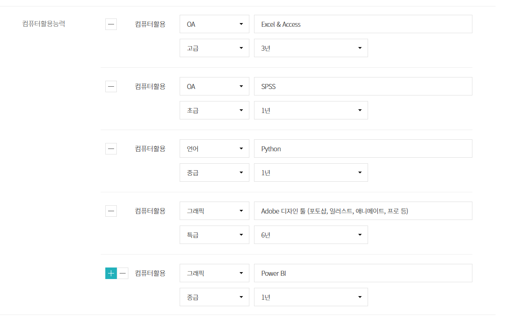
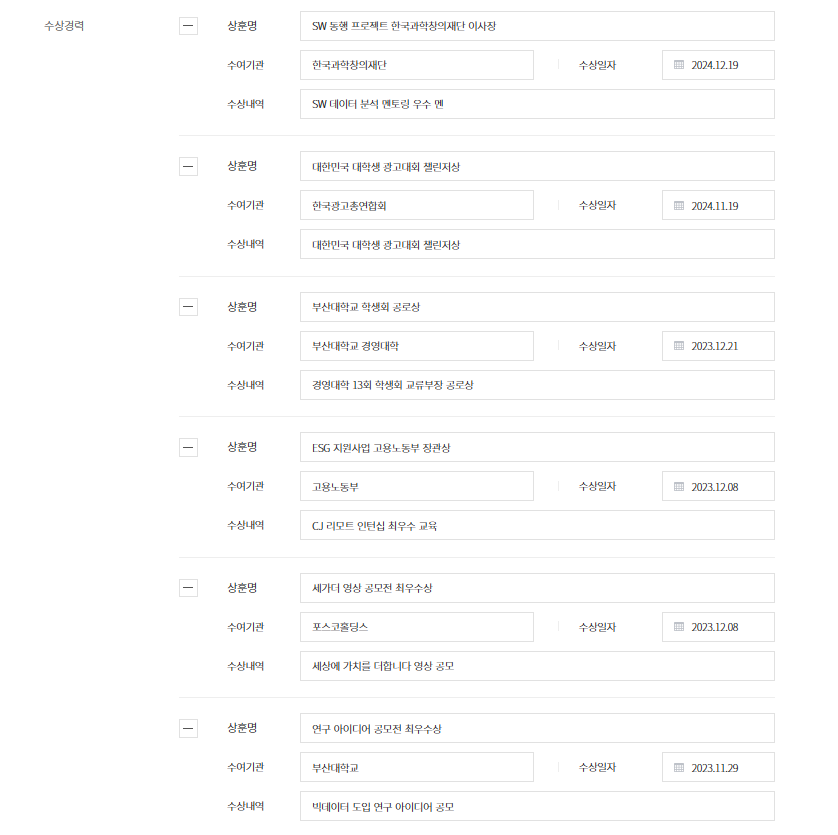
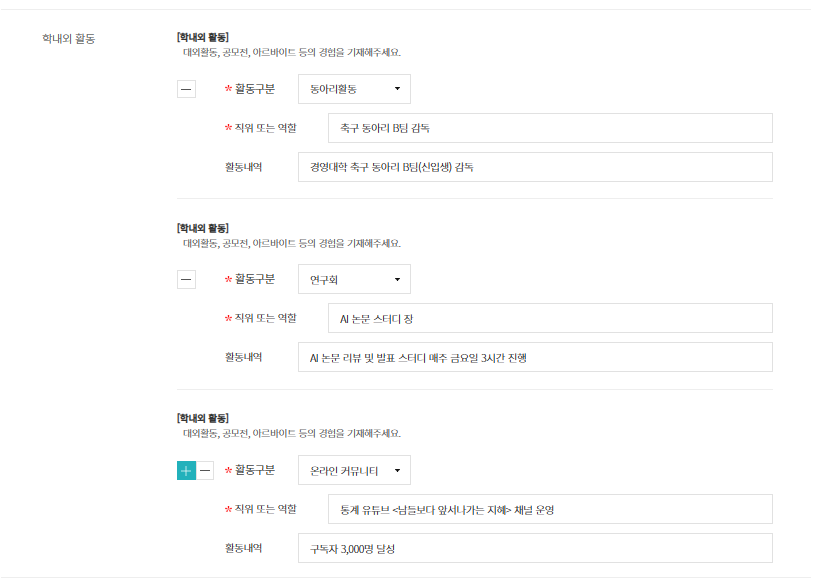

# 프로젝트 구조 정보

## 디렉토리 구조
```
-/
├── app.py                  # Flask 웹 애플리케이션 메인 파일
├── database.py             # SQLite DB 관리 모듈
├── resume_manager.py       # 이력서 데이터 관리 및 분석 로직
├── resume_data.json        # 이력서 원본 데이터 (JSON)
├── templates/
│   └── index.html         # 웹 인터페이스 템플릿
├── static/                # 정적 파일 (CSS, JS, 이미지)
└── *.pdf, *.jpg, *.xlsx   # 증빙 서류들
```

## 주요 파일 설명

### app.py
- Flask 기반 웹 서버
- API 엔드포인트 제공
- 포트: 5000

### database.py
- SQLite 기반 DB 관리
- 테이블: grades, certifications, awards, activities, projects, career
- CRUD 메서드 제공

### resume_data.json
- 개인정보, 학력, 교육, 경력, 자격증, 스킬, 활동, 수상, 프로젝트 정보
- **현재 문제**: 자격증 날짜가 "YYYY-MM" 형식 (일까지 필요)

## 현재 작업 상황
1. ~~DB 구축 중단 상태~~ → 완료
2. ~~자격증 날짜 형식 수정 필요~~ → 완료 (YYYY-MM-DD 형식)
3. 서버 배포 준비 필요
4. 수정 UI를 prompt() → 모달 폼으로 변경 중

## 중요 규칙 (반드시 준수)

### 날짜 형식
- **모든 날짜는 YYYY-MM-DD 형식** (년-월-일)
- 예: 2025-12-19, 2024-08-01
- 절대로 YYYY-MM 형식 사용 금지

### 자격증 필드
자격증 테이블/폼에 반드시 포함해야 할 필드:
- 자격증명 (name)
- 등급 (grade) - 없으면 "-"
- 발행처 (issuer)
- 취득일 (date) - YYYY-MM-DD
- 자격증번호 (number)
- **응시일자 (exam_date)** - YYYY-MM-DD ← 추가 필요

### 데이터 디테일 원칙
- 이 서비스는 **디테일한 정보 관리**가 목적
- 생략하지 말고, 필드가 많아도 전부 포함
- 사용자가 선택적으로 입력할 수 있게 하되, 필드 자체는 존재해야 함

### 수정 UI
- prompt() 순차 입력 방식 금지
- **모달 폼**으로 모든 필드를 한 번에 표시
- 사용자가 원하는 부분만 수정 가능하게
- **커스텀 필드 추가 기능**: 모든 항목(자격증, 수상, 활동, 프로젝트, 경력)에서 사용자가 필드를 직접 추가 가능
  - DB에 `extra_fields` 컬럼 (JSON 형태)
  - 모달에 "필드 추가" 버튼
  - 필드명 + 값 자유 입력

### 아카이브 기능
공식 문서 파일 관리용 탭 추가:
- 성적증명서
- 졸업증명서
- 수료증
- 자격증 사본
- 기타 증빙 서류
- 파일 업로드/다운로드/미리보기 지원
- DB 테이블: `archives` (id, name, category, file_path, upload_date, description)

## 스크린샷




